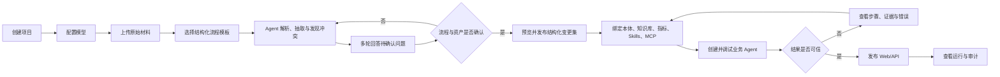
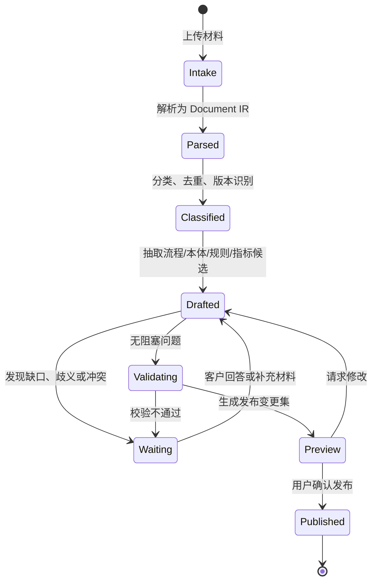
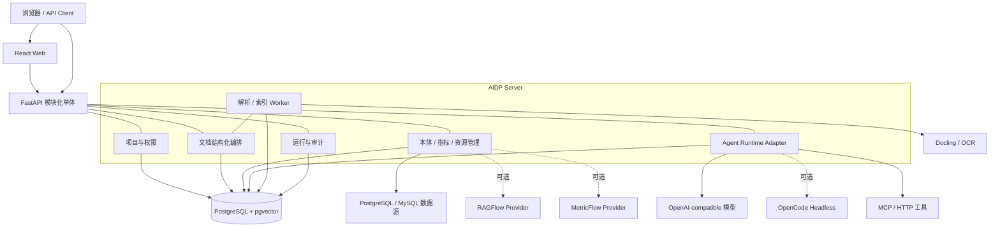

# AIDP 轻量智能决策平台产品需求文档

| 文档项 | 内容 |
| --- | --- |
| 产品名称 | AIDP（暂定，轻量智能决策平台） |
| 文档版本 | V0.2 |
| 文档状态 | 评审草案 |
| 创建日期 | 2026-07-29 |
| 目标版本 | MVP V0.2 |
| 目标读者 | 产品、研发、测试、实施、开源贡献者 |

## 1. 执行摘要

AIDP 面向需要在企业内部快速搭建智能决策应用的开发者、实施人员和业务专家。平台以“一个场景、少量配置、一天跑通”为首要体验，把原始业务文档、结构化数据、知识、指标、业务规则、Skills、MCP、本体和大模型组织为可发布、可追溯的智能体应用。

对于尚无线上管理系统的客户，AIDP 不能假设结构化数据已经存在。产品的第一入口应是“文档结构化工作台”：用户批量上传制度、流程、表单、台账、合同、邮件、图片等材料；文档结构化 Agent 先完成解析和分类，再通过可暂停、可恢复的多轮流程向客户提出问题，逐步确认流程边界、参与角色、业务对象、字段、规则和指标，最终把结果发布为版本化的标准流程、本体、结构化记录、知识库和指标模型。原始材料与每一个结构化结论之间必须保留证据关系。

产品不复刻大而全的数据治理、知识图谱或智能体中台。MVP 采用模块化单体架构，默认只依赖 PostgreSQL（含 pgvector），通过 Docker Compose 启动 Web、Server、Worker 和 Database。平台核心代码及必选依赖采用开源方案；模型层兼容 OpenAI-compatible API，可连接云端模型，也可连接 Ollama、vLLM、SGLang 等本地服务。

MVP 的成功标准不是菜单数量，而是用户能否完成两条连续链路：第一条把“散乱文档”变成“经客户确认的标准流程与结构化业务资产”；第二条把这些资产与 Skills、MCP、本体、指标和知识库绑定到 Agent，调试并发布为 Web/API。

## 2. 背景与问题

### 2.1 背景

现有 IDP 已覆盖数据连接、业务对象模型、知识网络、指标与质量、Skills、MCP、智能体、发布和运营等完整能力。完整平台适合企业级复杂建设，但也带来较高的部署、理解、开发和交付成本。对于单场景试点、小团队研发、私有化演示和二次开发，用户往往只需要其中的一条最小闭环。

本项目基于以下判断启动：

1. 大多数早期项目首先需要验证场景价值，而不是先建设完整中台。
2. 数据库、向量检索、任务状态、配置和审计可以在早期统一由 PostgreSQL 承载。
3. 业务对象与关系需要被表达，但不必在 MVP 中引入独立图数据库和重型建模体系。
4. 智能体需要可控、可追溯，但不必依赖复杂的多层编排平台。
5. 开源项目的首要竞争力应是易读、易改、易部署，而不是组件数量。
6. 对无业务系统的客户，文档既是初始数据源，也是业务流程、规则和指标的事实来源；平台必须先帮助客户把它们转化为可运营的数据资产。

### 2.2 核心问题

| 问题 | 现象 | 对用户的影响 |
| --- | --- | --- |
| 部署过重 | 多服务、多中间件、环境依赖复杂 | 首次启动和私有化交付耗时长 |
| 概念过多 | 数据源、模型、知识网络、技能、工具等对象层级深 | 新用户学习和排错成本高 |
| 场景交付链路长 | 同一场景需跨多个模块创建和发布资源 | 演示与试点迭代慢 |
| 二次开发困难 | 服务边界多、调用链长、版本协同复杂 | 小团队难以维护自己的分支 |
| 结论可信度不足 | 通用聊天应用难以展示数据、规则与工具证据 | 高价值业务场景难以落地 |
| 文档无法形成系统 | 客户只有文件夹、Excel、制度和表单，没有线上系统 | Agent 没有稳定的数据结构、流程状态和指标口径可用 |
| 结构化过程缺少确认 | 一次性抽取无法处理口径歧义、材料冲突和隐性经验 | 自动入库结果看似完整，实际不可运营 |

### 2.3 产品机会

AIDP 在“通用聊天/RAG 工具”和“完整企业智能决策中台”之间提供一个开源、轻量、可扩展的选择：既能从原始材料生成一个最小可运营业务系统，又保留企业决策所需的本体、指标、证据、规则、权限和审计能力，同时把默认部署和核心概念压缩到最低。

## 3. 产品定位

### 3.1 一句话定位

用一套可读、可改、可单机运行的开源软件，把企业文档转化为标准流程与结构化业务资产，再把数据、知识、指标、规则和工具组装成可追溯的智能决策应用。

### 3.2 产品愿景

让一个熟悉 Python/SQL 的开发者，无需平台专项培训，也能在一天内完成一个真实企业智能决策场景的搭建、发布和排错。

### 3.3 核心原则

1. **场景优先**：所有资源归属项目，用户围绕一个业务场景工作。
2. **最少依赖**：默认只引入不可替代的基础组件。
3. **配置即文件**：关键配置可导出为 YAML/JSON，便于版本管理和迁移。
4. **代码可逃生**：界面能做的配置有对应 API；配置不足时允许用 Python 扩展。
5. **证据优先**：回答必须能回溯到数据行、文档片段、规则命中或工具返回。
6. **安全默认**：查询可自动执行，写入或流程动作默认需要人工确认。
7. **渐进增强**：先让单机 MVP 好用，再增加高可用和企业治理能力。
8. **机器建议、人工定稿**：Agent 可以抽取、归并和推荐，但流程、本体、指标和写操作必须经过明确的确认与发布。

### 3.4 产品边界

AIDP 是：

- 智能决策场景的配置、运行、调试和发布工具；
- 面向无线上系统客户的文档结构化、流程标准化和最小业务台账工具；
- 数据查询、文档检索、规则判断与工具调用的统一智能体运行时；
- 适合开发、演示、试点和中小规模私有化使用的开源基础软件。

AIDP 不是：

- 全量数据治理、主数据管理或数据仓库平台；
- 通用低代码/BPM 平台；
- 完整知识图谱生产与治理平台；
- 大模型训练、微调或推理集群管理平台；
- 允许智能体无审批操作生产系统的 RPA 平台；
- 为追求高并发而预先拆分的微服务集合。

## 4. 目标与非目标

### 4.1 MVP 目标

| 编号 | 目标 | 衡量方式 |
| --- | --- | --- |
| G1 | 降低部署门槛 | 全新环境执行不超过 3 条命令，15 分钟内进入登录页 |
| G2 | 缩短首个场景搭建时间 | 具备样例材料时，90 分钟内完成结构化与可对话应用 |
| G3 | 建立最小决策闭环 | 一次运行可组合数据/知识、规则、工具，并生成证据链 |
| G4 | 支持二次开发 | 核心模块边界清晰，新增一种工具或连接器不修改运行时主流程 |
| G5 | 支持私有部署 | 无强制外部 SaaS 依赖，可连接本地模型端点 |
| G6 | 保证可追溯性 | 每次运行保存输入、步骤、证据、输出、耗时和操作者 |
| G7 | 从文档形成可运营数据 | 每个标杆材料包可生成经确认的流程、本体、记录和指标候选，且能追溯原文 |

### 4.2 MVP 非目标

- 不支持 Kubernetes 生产编排和跨地域高可用。
- 不建设独立数据目录、血缘、主数据、元数据审批流。
- 不提供可视化知识图谱编辑器和复杂图推理。
- 不支持任意拖拽式工作流编排；仅提供线性智能体循环和固定的确认节点。
- 不提供多智能体群聊、自治任务分解和长周期无人值守执行。
- 不用一次性全自动抽取替代业务专家确认；存在歧义时必须暂停并提问。
- 不追求海量文档、百亿级向量或千级并发。
- 不在首版内置模型训练、标注和评测集市场。

## 5. 目标用户

| 用户 | 主要诉求 | 典型任务 |
| --- | --- | --- |
| AI/后端开发者 | 快速集成企业数据和模型，保留代码扩展能力 | 开发连接器、工具、智能体，接入业务系统 |
| 解决方案/实施人员 | 用少量配置快速交付可演示场景 | 导入材料、配置规则、发布应用、排查运行链路 |
| 业务专家 | 校验数据口径、规则和智能体结论 | 维护规则、查看证据、确认敏感动作、反馈结果 |
| 流程负责人/资料管理员 | 把散乱材料变成标准流程和台账 | 上传文档、回答澄清问题、确认流程、本体、字段和指标 |
| 平台管理员 | 控制用户、模型、凭证和审计 | 管理成员、密钥、资源权限与运行记录 |

MVP 的主用户是 AI/后端开发者和实施人员。业务专家使用简化的规则、测试与审核界面；复杂治理能力后置。

## 6. 典型场景

### 6.1 从文档建立最小业务系统

客户没有流程系统，只有制度 PDF、岗位说明 DOCX、申请表 XLSX、历史台账和邮件。资料管理员把它们上传到项目后，选择“流程与台账结构化”模板。Agent 识别出候选流程和对象，按主题提出阻塞问题，例如流程起止点、审批角色、表单字段口径、分支条件和历史材料冲突。客户可以分多轮回答，也可以邀请不同负责人确认。完成确认后，平台生成标准流程、对象与关系、结构化记录、规则和指标候选；用户预览变更集后一次发布。发布结果可立即被后续 Agent、API 和简易台账页使用。

### 6.2 合同风险审核

用户上传合同并选择项目。智能体抽取条款，查询交易对手与历史合同数据，匹配制度规则，必要时调用外部尽调工具，最终输出风险等级、命中规则、引用证据和修改建议。发起审批属于写操作，需用户确认后执行。

### 6.3 采购流程合规检查

用户输入项目或流程编号。智能体查询采购金额、供应商、审批节点和附件状态，根据金额阈值与制度规则判断流程是否完整，并列出缺失材料、异常节点和处置建议。

### 6.4 经营指标问数与 Text-to-Metric

用户可以用自然语言创建或查询指标。创建模式下，Metric Agent 生成名称、业务定义、事实表、度量、聚合、维度、时间粒度、过滤条件、单位和 SQL 预览，并通过多轮问题确认“订单金额按下单还是回款时间”等歧义；查询模式下，只能调用已发布指标并返回数据、口径、时间范围、SQL 摘要和可核验来源。

### 6.5 运维故障辅助

用户描述故障或输入设备编号。智能体组合设备台账、告警数据、运维手册和诊断 API，输出可能原因、证据、排查步骤；创建工单需人工确认。

## 7. MVP 核心用户旅程



首屏应直接呈现上述旅程，不要求用户理解底层模块拓扑。若用户已有数据库，可以跳过文档结构化；若用户只有材料，平台先引导完成结构化工作台。新项目创建后提供一份可运行样例，用户可以替换数据逐步学习。

## 8. 信息架构

平台一级导航控制在 6 项以内：

1. **项目**：项目列表、概览、成员和环境配置。
2. **结构化工作台**：原始材料、处理任务、多轮问题、流程草稿和发布变更集。
3. **资源**：本体、数据集、知识库、指标、规则、Skills、MCP 和工具统一管理。
4. **智能体**：创建、绑定、版本和发布。
5. **调试与运行**：对话、输入变量、步骤、证据、审批和历史记录。
6. **系统设置**：模型供应商、用户、密钥和系统状态。

同一资源只保留一个权威配置入口，避免“创建在 A、发布在 B、授权在 C”的跨模块链路。

## 9. 功能需求

优先级定义：P0 为 MVP 必须具备；P1 为 MVP 后首批增强；P2 为远期候选。

### 9.1 项目与成员

| 编号 | 优先级 | 需求 |
| --- | --- | --- |
| PROJ-01 | P0 | 创建、编辑、归档项目；名称在工作区内唯一 |
| PROJ-02 | P0 | 项目包含资源、智能体、运行记录和成员，不允许资源跨项目隐式引用 |
| PROJ-03 | P0 | 提供管理员、编辑者、查看者三种项目角色 |
| PROJ-04 | P0 | 新项目可选择“空白项目”或“示例项目” |
| PROJ-05 | P1 | 项目一键导出/导入，配置采用可读的 YAML/JSON，密钥不随包导出 |
| PROJ-06 | P2 | 组织、空间、跨项目公共资源库与资源审批 |

验收要点：

- 编辑者可以管理项目资源但不能管理全局模型密钥。
- 查看者不能修改配置或执行待确认动作。
- 归档项目后停止其公开入口，但保留历史运行记录。

### 9.2 模型供应商

| 编号 | 优先级 | 需求 |
| --- | --- | --- |
| MODEL-01 | P0 | 支持配置 OpenAI-compatible Chat Completions/Responses 端点 |
| MODEL-02 | P0 | 模型配置包含名称、Base URL、模型 ID、密钥、上下文长度和超时 |
| MODEL-03 | P0 | 保存前执行连通性测试，密钥加密存储且界面不回显 |
| MODEL-04 | P0 | 分别指定默认对话模型与向量模型 |
| MODEL-05 | P1 | 支持按项目限制可用模型，并记录 token 用量和估算成本 |
| MODEL-06 | P2 | 路由、熔断、限流和多模型自动降级 |

MVP 不自带模型推理服务，只负责连接模型端点。离线部署文档应提供 Ollama/vLLM/SGLang 示例。

### 9.3 原始材料与文档结构化 Agent

文档结构化不是一次“上传并向量化”，而是一项有状态、有检查点、有人机确认的业务建模任务。每次任务称为 `Structuring Case`，可以跨小时或跨天暂停、继续、转交和重新打开。

#### 9.3.1 输入与预处理

| 编号 | 优先级 | 需求 |
| --- | --- | --- |
| DOC-01 | P0 | 批量上传 PDF、DOCX、PPTX、XLSX、CSV、Markdown、TXT、HTML、常见图片和 EML |
| DOC-02 | P0 | 同一任务支持文件夹、压缩包和多批次补充材料；保留目录、文件名、哈希、页码和上传人 |
| DOC-03 | P0 | 使用 Docling 生成统一 Document IR，保留标题层级、段落、表格、图片、页码、坐标和阅读顺序 |
| DOC-04 | P0 | 扫描件和图片支持本地 OCR；OCR 置信度低于阈值时标记待复核 |
| DOC-05 | P0 | 文件自动分类为制度、流程说明、岗位说明、表单、台账、合同、邮件或其他，并允许人工修改 |
| DOC-06 | P0 | 文件重复、版本近似、内容冲突和解析失败必须可见，不允许静默覆盖 |
| DOC-07 | P1 | 旧版 DOC/XLS/PPT 通过可选 LibreOffice 转换；音视频通过可选 ASR 形成文本 |

#### 9.3.2 标准化流程模板

MVP 内置四类结构化模板，每类模板由确定性阶段、Agent Skill、输入/输出 schema 和确认策略组成：

| 模板 | 适用材料 | 主要输出 |
| --- | --- | --- |
| 流程与台账结构化 | 流程说明、制度、岗位、表单、Excel 台账 | 流程、活动、角色、表单、业务对象、字段、记录 |
| 制度与规则结构化 | 管理办法、检查表、审批制度 | 条款、适用范围、条件规则、风险级别、依据 |
| 指标口径结构化 | 报表说明、经营分析、Excel 公式 | 指标、度量、维度、时间口径、过滤、单位、来源 |
| 合同/材料抽取 | 合同、申请材料、附件包 | 文档类型 schema 对应的对象实例、缺失项和证据 |

管理员可以复制模板并调整 Skill、问题策略、输出 schema 和发布目标，但 MVP 不提供任意拖拽工作流。

#### 9.3.3 多轮结构化流程



| 编号 | 优先级 | 需求 |
| --- | --- | --- |
| DOC-08 | P0 | 每一阶段保存输入、输出、状态、版本、运行日志和证据，刷新或重启后可继续 |
| DOC-09 | P0 | Agent 把问题分为阻塞、建议确认、信息补充三类，并说明原因、影响、建议答案和引用证据 |
| DOC-10 | P0 | 支持单选、多选、短文本、表格修订、文件补充和“交给其他人回答” |
| DOC-11 | P0 | 同一轮优先合并同主题问题，默认不超过 8 个；回答后只重跑受影响阶段 |
| DOC-12 | P0 | 问题可以暂存、跳过、重新打开；阻塞问题未关闭时禁止发布相关资产 |
| DOC-13 | P0 | 不同文档结论冲突时并列展示原文、文档日期和 Agent 建议，必须由用户选择或建立适用条件 |
| DOC-14 | P0 | 支持在流程图、对象表、字段表、规则表和指标表中直接修改 Agent 草稿，修改自动进入决策日志 |
| DOC-15 | P0 | 发布前生成结构化变更集，区分新增、修改、合并、忽略和删除建议 |
| DOC-16 | P0 | 发布采用事务：本体、流程、记录、规则、指标和知识索引要么全部成功，要么保留草稿并回滚 |
| DOC-17 | P1 | 支持两人复核、按问题分派负责人、截止日期和通知 |
| DOC-18 | P2 | 跨项目模板市场、主动学习和行业模板自动推荐 |

#### 9.3.4 标准流程输出协议

每个已发布流程至少包含以下结构：

| 对象 | 必填内容 |
| --- | --- |
| Process | 编码、名称、目的、触发条件、开始/结束状态、负责人、适用范围、版本 |
| Activity | 序号、名称、执行角色、输入、动作、输出、前置条件、完成条件、时限 |
| Gateway | 分支条件、判断口径、默认路径和异常路径 |
| Role | 角色名称、职责、可执行动作和数据范围 |
| Artifact | 表单/材料名称、字段 schema、必填性、来源和生命周期 |
| Business Object | 对象类型、属性、标识、状态、关系和敏感级别 |
| Rule | 条件、结果、级别、依据、适用环节和版本 |
| Metric Candidate | 名称、业务定义、度量、维度、时间口径、单位和来源 |
| Evidence Link | 结论对应的文件版本、页码/单元格、原文片段和解析置信度 |

MVP 使用 AIDP Process Schema（JSON/YAML）作为权威格式，并提供流程图预览；BPMN 2.0 导入导出作为 P1，避免首版承担完整 BPMN 执行引擎。

### 9.4 本体与结构化业务库

AIDP 参考 IDP 的对象类、关系类和行动类模型，但用 PostgreSQL 元数据表与 JSONB 记录实现轻量本体，不引入独立图数据库或 OpenSearch。本体既能由用户手工创建，也能由文档结构化任务生成候选变更。

| 编号 | 优先级 | 需求 |
| --- | --- | --- |
| ONTO-01 | P0 | 定义对象类、属性、关系类、行动类、枚举、标识字段、状态字段和敏感级别 |
| ONTO-02 | P0 | 对象类和关系类支持不可变版本；已发布 Agent 绑定固定版本或兼容版本范围 |
| ONTO-03 | P0 | 文档结构化任务可创建对象实例，并保留字段级证据、置信度和确认状态 |
| ONTO-04 | P0 | 同一候选实例支持去重、合并和主键冲突处理，合并过程可追溯 |
| ONTO-05 | P0 | 提供对象列表、详情、关系导航和简易增删改查页面，形成最小线上台账 |
| ONTO-06 | P0 | Action 必须声明输入 schema、权限、是否需确认及其绑定的 HTTP/MCP 工具 |
| ONTO-07 | P0 | Agent 可按本体、对象类型和动作范围绑定，并分别授予 read/query/create/update/execute 权限 |
| ONTO-08 | P1 | 支持本体分支、差异比较、映射规则和图形化关系浏览 |
| ONTO-09 | P2 | 多跳图查询优化、跨本体映射和外接图数据库 Provider |

### 9.5 数据集与语义配置

“数据集”用于接入已经存在的结构化数据；“结构化业务库”用于承接从文档生成的数据。两者在 Agent 查询层使用统一的语义字段、关系、权限和证据协议。

| 编号 | 优先级 | 需求 |
| --- | --- | --- |
| DATA-01 | P0 | 支持 PostgreSQL、MySQL 只读连接 |
| DATA-02 | P0 | 支持上传 CSV/XLSX，映射到已有对象类或创建候选对象类后再导入 |
| DATA-03 | P0 | 扫描用户勾选的表、字段、类型和主外键，不默认扫描整个实例 |
| DATA-04 | P0 | 用户可编辑表/字段业务名称、说明、枚举和敏感级别 |
| DATA-05 | P0 | 用户可配置表关系、常用筛选条件及其本体映射 |
| DATA-06 | P0 | 提供 SQL 预览与测试；运行时仅允许 SELECT/CTE，设置行数和超时上限 |
| DATA-07 | P0 | 查询证据包含数据集、表/视图、字段、查询时间和结果摘要 |
| DATA-08 | P1 | 支持 REST API 数据源、定时同步和数据质量规则 |
| DATA-09 | P2 | Oracle、SQL Server、ClickHouse、数据血缘与跨源联邦查询 |

验收要点：

- 数据库凭证不进入智能体上下文或前端响应。
- SQL 经解析器校验后执行，禁止 DDL、DML、多语句和未授权对象访问。
- 超过返回上限时给出明确提示，不静默截断后生成确定性结论。

### 9.6 知识库

MVP 内置轻量知识库 Provider，使用 Docling、PostgreSQL 全文检索和 pgvector。高级场景可以连接外部 RAGFlow，但 RAGFlow 不属于默认部署依赖。

| 编号 | 优先级 | 需求 |
| --- | --- | --- |
| KNOW-01 | P0 | 原始材料可选择进入一个或多个知识库，不需要重复上传和解析 |
| KNOW-02 | P0 | 基于 Document IR 按标题、段落、表格和页码进行结构感知切分，不只按固定字符数切分 |
| KNOW-03 | P0 | 支持全文 + 向量混合检索、元数据过滤、Top-K、阈值和可选 reranker |
| KNOW-04 | P0 | 提供切片预览、检索测试和命中解释；用户可禁用或修订错误切片 |
| KNOW-05 | P0 | 回答引用定位到文件版本、页码/段落/表格，并展示原文片段 |
| KNOW-06 | P0 | 文件更新后生成新版本；历史运行仍指向原版本证据，索引切换原子化 |
| KNOW-07 | P0 | 定义 `KnowledgeProvider` 接口，覆盖创建库、索引、检索、删除、健康检查和引用回链 |
| KNOW-08 | P1 | 提供 RAGFlow Provider，通过其 API 复用复杂版面解析、模板切分、检索和引用能力 |
| KNOW-09 | P1 | 支持网页、对象存储目录、OCR/VLM 解析策略和父子切片 |
| KNOW-10 | P2 | 知识审批、自动去重、GraphRAG 和跨库知识治理 |

Provider 选择原则：默认知识库必须在 AIDP 的 4 容器拓扑内运行；只有客户明确需要复杂版面、海量文档或已有 RAGFlow 环境时，才启用外部 Provider。

### 9.7 指标模型与 Text-to-Metric

Text-to-Metric 包含两个不同能力：`Author` 把自然语言或文档口径转成可治理的指标定义；`Query` 把用户问题转成对已发布指标的安全查询。两者不得混为任意 Text-to-SQL。

| 编号 | 优先级 | 需求 |
| --- | --- | --- |
| METRIC-01 | P0 | 指标定义包含名称、业务定义、度量、聚合、维度、时间维度/粒度、过滤、单位、格式和负责人 |
| METRIC-02 | P0 | 支持 simple、ratio、derived、cumulative 四类指标及指标依赖校验 |
| METRIC-03 | P0 | Author 模式从自然语言、文档片段或 Excel 公式生成候选定义，并引用口径来源 |
| METRIC-04 | P0 | 发现歧义时生成多轮问题，至少覆盖事实来源、时间口径、去重键、聚合、过滤、单位和空值处理 |
| METRIC-05 | P0 | 发布前显示 Metric IR、编译 SQL、样例结果、数据血缘和与已有指标的重名/冲突 |
| METRIC-06 | P0 | Query 模式只允许选择已发布指标、维度、过滤和时间范围，再由确定性编译器生成 SQL |
| METRIC-07 | P0 | 返回结果同时展示指标定义版本、实际过滤、数据时间、单位、SQL 摘要和证据 |
| METRIC-08 | P0 | 指标可绑定到本体对象、数据集字段和 Agent；历史运行固定引用指标版本 |
| METRIC-09 | P1 | Metric IR 可导入/导出 MetricFlow 风格 YAML，并提供 MetricFlow 编译 Provider |
| METRIC-10 | P2 | 指标认证、变更影响分析、预聚合和外接 Cube Provider |

MVP 对 PostgreSQL/MySQL 实现内置编译器，只覆盖明确的 P0 指标类型。复杂多跳语义查询不由大模型直接拼 SQL；无法编译时必须返回待完善的指标定义。

### 9.8 规则

规则用于表达必须确定执行的业务判断，不让大模型临时猜测阈值和逻辑。

| 编号 | 优先级 | 需求 |
| --- | --- | --- |
| RULE-01 | P0 | 创建条件规则：名称、说明、适用对象、条件、结论、风险级别和依据 |
| RULE-02 | P0 | 支持 `=、!=、>、>=、<、<=、in、contains、is empty` 和 AND/OR 组合 |
| RULE-03 | P0 | 提供表单编辑和 JSON/YAML 预览，不执行任意用户代码 |
| RULE-04 | P0 | 支持用样例输入单条或批量测试规则 |
| RULE-05 | P0 | 每次命中记录规则版本、输入摘要、结果和依据 |
| RULE-06 | P1 | 决策表、规则组优先级、生效时间与审批发布 |
| RULE-07 | P2 | 复杂规则语言、事件流规则和外部规则引擎适配 |

### 9.9 Skills、工具与 MCP

#### 9.9.1 工具与 MCP 连接

| 编号 | 优先级 | 需求 |
| --- | --- | --- |
| TOOL-01 | P0 | 支持配置 HTTP 工具：方法、URL、请求 schema、响应映射和超时 |
| TOOL-02 | P0 | 支持连接 MCP Server，并同步可用工具及其输入 schema |
| TOOL-03 | P0 | 工具分为查询、生成、写入、流程四类 |
| TOOL-04 | P0 | 写入类和流程类默认需要人工确认；确认页展示工具、参数和风险提示 |
| TOOL-05 | P0 | 密钥使用项目 Secret 引用，日志和模型上下文中自动脱敏 |
| TOOL-06 | P0 | 调试模式可输入样例参数，查看原始请求、响应、耗时和错误 |
| TOOL-07 | P1 | Python 插件工具，使用受限容器或独立进程执行 |
| TOOL-08 | P2 | 工具市场、OAuth 授权和细粒度出站网络策略 |

#### 9.9.2 Skills 资产

| 编号 | 优先级 | 需求 |
| --- | --- | --- |
| SKILL-01 | P0 | Skill 使用带 YAML frontmatter 的 `SKILL.md`，包含名称、描述、版本、输入/输出约束和正文指令 |
| SKILL-02 | P0 | 支持项目级 Skill 创建、上传、预览、版本化、启停和权限控制 |
| SKILL-03 | P0 | Skill 可引用同包内模板与只读参考文件，发布时形成内容寻址的不可变包 |
| SKILL-04 | P0 | MCP Server 支持 stdio 和 Streamable HTTP，连接后同步 tools/prompts/resources 与 schema |
| SKILL-05 | P0 | Agent 绑定时可只授权 MCP Server 的部分工具，不把未授权能力暴露给模型 |
| SKILL-06 | P0 | Tools、子 Agent、MCP 和 Skills 在一个“能力”面板绑定，但保留类型、版本、超时和权限 |
| SKILL-07 | P1 | 兼容 `.agents/skills/<name>/SKILL.md` 导入导出，便于与 OpenCode 等开源 Agent 生态交换 |

### 9.10 智能体与资源绑定

| 编号 | 优先级 | 需求 |
| --- | --- | --- |
| AGENT-01 | P0 | 创建智能体：名称、描述、系统指令、模型、欢迎语和示例问题 |
| AGENT-02 | P0 | 从当前项目绑定本体、数据集、知识库、指标、规则、Skills、Tools、子 Agent 和 MCP |
| AGENT-03 | P0 | 运行时支持“理解问题—选择能力—调用—汇总—引用证据”的受限循环 |
| AGENT-04 | P0 | 单次运行的最大步骤数、最大耗时和 token 上限可配置 |
| AGENT-05 | P0 | 对无法获得证据、证据冲突、数据过期和工具失败给出显式提示 |
| AGENT-06 | P0 | 每次保存产生不可变版本；发布入口绑定指定版本 |
| AGENT-07 | P0 | 支持流式输出、停止生成和重新运行 |
| AGENT-08 | P1 | 结构化输出 schema、会话变量、记忆策略和定时任务 |
| AGENT-09 | P2 | 多智能体协作、可视化任意工作流和长周期自治运行 |
| AGENT-10 | P0 | 每个绑定项固定资源 ID、版本/版本范围、授权范围、超时、输入映射和是否需人工确认 |
| AGENT-11 | P0 | 保存 AgentManifest 前检查资源存在、版本已发布、权限有效、schema 兼容和循环依赖 |
| AGENT-12 | P0 | 支持 `builtin` 与 `opencode` 两种 Runtime Provider；同一 Agent 版本固定一个 Provider |
| AGENT-13 | P0 | 文档结构化 Agent 使用持久会话、问题事件和权限事件，支持暂停、恢复和转交 |
| AGENT-14 | P1 | 支持把已发布 Agent 作为另一个 Agent 的能力，并设置最大嵌套深度为 1 |

运行时约束：

- 默认最大 8 个步骤、120 秒；超限后停止并返回已完成步骤。
- 工具参数必须通过 schema 校验，不允许模型直接拼接未校验请求。
- 模型生成内容与真实工具结果分开存储，界面可明确区分。
- 结论中的引用必须指向本次运行已获取的证据对象。
- OpenCode Provider 默认禁用 shell、任意文件写入、无限子 Agent 和未绑定 MCP，仅开放任务工作区与声明的能力。

AgentManifest 的资源绑定结构示例：

```yaml
runtime:
  provider: opencode
  profile: document-structuring
bindings:
  ontologies:
    - id: procurement
      version: 3
      object_types: [Project, Supplier, Approval]
      permissions: [read, query, create-draft]
  knowledge_bases:
    - id: procurement-policy
      version: 5
      retrieval_profile: hybrid-default
  metrics:
    - id: approval-cycle-time
      version: 2
  skills:
    - id: process-extraction
      version: 4
  mcp_servers:
    - id: supplier-query
      tools: [get_supplier_profile]
      permission: allow
  tools:
    - id: create_remediation_task
      permission: ask
```

### 9.11 调试、证据与评测

| 编号 | 优先级 | 需求 |
| --- | --- | --- |
| DEBUG-01 | P0 | 调试台同时展示对话区和步骤时间线 |
| DEBUG-02 | P0 | 每一步展示类型、输入摘要、输出摘要、耗时、状态和错误 |
| DEBUG-03 | P0 | 证据面板统一展示数据行、文档片段、规则命中和工具响应 |
| DEBUG-04 | P0 | 支持对结果点赞/点踩并填写反馈 |
| DEBUG-05 | P0 | 支持复制运行 ID 和导出单次运行 JSON |
| DEBUG-06 | P1 | 创建测试集，批量运行并对引用完整率、规则命中和人工评分统计 |
| DEBUG-07 | P2 | 模型对比、自动评审、提示词优化建议和线上 A/B 测试 |

### 9.12 发布与访问

| 编号 | 优先级 | 需求 |
| --- | --- | --- |
| PUB-01 | P0 | 智能体可发布为平台内 Web 对话页 |
| PUB-02 | P0 | 可生成项目级 API Key，通过 REST API 创建会话和发送消息 |
| PUB-03 | P0 | API Key 只显示一次，可撤销、设置有效期并记录最后使用时间 |
| PUB-04 | P0 | 发布、更新版本和下线均记录操作者与时间 |
| PUB-05 | P1 | 可嵌入 Chat Widget，支持品牌色和欢迎语配置 |
| PUB-06 | P2 | 多环境发布、灰度、限流套餐和公开应用市场 |

### 9.13 运行记录、审批与审计

| 编号 | 优先级 | 需求 |
| --- | --- | --- |
| OPS-01 | P0 | 按项目、智能体、状态、用户和时间筛选运行记录 |
| OPS-02 | P0 | 运行详情保留模型、智能体版本、步骤、证据、错误和耗时 |
| OPS-03 | P0 | 待确认动作支持批准或拒绝，并记录意见 |
| OPS-04 | P0 | 写操作执行后记录实际请求、脱敏响应和执行状态，禁止伪造成功 |
| OPS-05 | P0 | 配置变更、密钥操作、发布和成员操作进入审计日志 |
| OPS-06 | P1 | 重试、取消后台任务，提供基础用量与错误率看板 |
| OPS-07 | P2 | 告警通知、审计归档、SIEM 对接和自定义留存策略 |

## 10. 关键交互要求

### 10.1 项目概览

项目概览不展示空泛统计，应展示完成最小闭环所需的检查清单：

- 模型是否可用；
- 是否存在未解析材料、阻塞问题或待发布结构化变更；
- 至少一个数据集或知识库是否就绪；
- 是否存在可测试的智能体；
- 最近一次运行是否成功；
- 是否存在待确认动作或失败任务。

### 10.2 结构化工作台

桌面端采用“任务导航 + 主画布 + 证据/问题侧栏”：

- 左侧展示任务阶段、材料目录和各阶段状态；
- 中间在文档预览、流程图、对象表、字段表、规则表、指标表和发布差异之间切换；
- 右侧展示当前选中结论的原文证据、Agent 解释和待确认问题；
- 顶部始终展示未解决阻塞问题数、草稿版本、最近保存时间和负责人；
- 用户离开页面不会丢失 Agent 状态，返回后从上一个检查点继续。

问题不能只存在于聊天气泡中。每个问题是独立的 `ConfirmationTask`，具备状态、负责人、答案、证据、影响范围和决策记录；聊天只是回答问题的一种入口。

### 10.3 调试台

桌面端采用三栏布局：左侧为会话与输入，中间为回答，右侧为步骤与证据。窄屏时步骤与证据收进抽屉。用户点击回答引用时，右侧定位到对应证据，不跳出当前对话。

### 10.4 错误呈现

错误必须包含：失败阶段、用户可读原因、可执行的解决建议和运行 ID。调试者可以展开技术详情，但普通使用者默认不看到堆栈、密钥或数据库连接信息。

### 10.5 空状态与示例

所有核心资源的空状态都提供一个可运行示例或最短创建路径。示例项目应包含一份采购制度、一份流程说明、一份申请表、一份小型历史台账、两条规则和一个 Mock HTTP 工具，完整演示“原始材料 → 多轮确认 → 流程/本体/记录/指标/知识库 → Agent → 证据链”。

## 11. 技术方案建议

本章是约束研发复杂度的产品级技术决策。具体库版本在技术设计阶段确定。

### 11.1 架构原则

- 采用模块化单体，按领域拆包，不按领域拆服务。
- Web、API 和 Worker 共用一个仓库、一个领域模型和一套迁移脚本。
- 在线请求与后台任务可分进程运行，但不引入独立消息队列；任务状态与抢占锁存入 PostgreSQL。
- 统一使用 PostgreSQL 存储业务数据、配置、审计、全文索引和向量。
- Agent Runtime、Knowledge Provider、Metric Compiler、外部模型、数据库、MCP 与 HTTP 服务均通过适配器接入。
- 文档处理采用“确定性解析/校验 + Agent 语义抽取/提问”，不让 Agent 替代文件解析器或事务发布器。
- OpenCode、RAGFlow 和 MetricFlow 均为可插拔 Provider；它们的不可用不得破坏核心配置与历史数据。
- 首版不引入 Kubernetes、Kafka、RabbitMQ、Redis、Elasticsearch、MinIO、Neo4j 和独立向量数据库。

### 11.2 逻辑架构



### 11.3 建议技术栈

| 层次 | 选择 | 选择理由 |
| --- | --- | --- |
| 前端 | React + TypeScript + Vite + Ant Design | 生态成熟，后台界面开发成本低，避免 SSR 复杂度 |
| 后端 | Python 3.12 + FastAPI + Pydantic | AI 生态完整，API 与 schema 开发直接 |
| ORM/迁移 | SQLAlchemy + Alembic | 成熟、显式、易于维护 |
| 数据库 | PostgreSQL 16 + pgvector | 同时覆盖配置、业务、全文、任务和向量检索 |
| 文档解析 | [Docling](https://github.com/docling-project/docling) + 可插拔 OCR | 多格式、本地运行、统一文档表示，保留版面和表格结构 |
| 文档流程 | PostgreSQL 持久状态机 + Agent Skills | 多轮任务可暂停恢复，确定性阶段和 Agent 阶段边界清晰 |
| 智能体运行时 | 内置小型 Tool loop；[OpenCode](https://github.com/anomalyco/opencode) Headless 可选 | 默认部署轻；需要成熟会话、问题、权限、Skills/MCP 时可复用开源运行时 |
| 知识库 | Docling + PostgreSQL FTS + pgvector；[RAGFlow](https://github.com/infiniflow/ragflow) 可选 | 默认只用单库；复杂版面与大规模检索可外接成熟开源引擎 |
| 指标 | 内置 Metric IR/编译器；[MetricFlow](https://github.com/dbt-labs/metricflow) 可选 | 先覆盖常用指标并保持轻量，复杂指标可接 Apache-2.0 编译器 |
| MCP | 官方开源 MCP Python SDK | 减少协议自实现 |
| 认证 | 本地账号 + Argon2 + JWT/安全 Cookie | MVP 无外部身份系统依赖 |
| 部署 | Docker Compose | 一套命令覆盖开发、演示和单机私有化 |
| 测试 | pytest + Playwright | 覆盖领域逻辑、API 和关键用户旅程 |

### 11.4 开源组件采用策略

| 项目 | 可复用能力 | 不直接照搬的部分 | AIDP 决策 |
| --- | --- | --- | --- |
| IDP/KWeaver | `data_source` 独立绑定文档、指标和知识网络；`skills` 统一容纳 Tool、Agent、MCP、Skill；本体包含对象、关系、行动 | 本体与检索依赖多个服务、MariaDB/OpenSearch 等完整平台设施 | 保留资源/版本/权限语义，改为一个 AgentManifest 和 PostgreSQL 轻量实现 |
| OpenCode（MIT） | Headless Server、SDK/SSE、持久会话、问题/权限事件、按需 Skills、MCP 与工具权限 | 代码代理默认具备文件系统、Shell 和子 Agent 语义，直接作为核心服务会增加运行栈 | 作为可选 Runtime Provider；采用其事件/权限思想，但默认禁用代码执行能力 |
| Docling（MIT） | 多格式解析、PDF 版面/表格理解、OCR、统一 JSON 表示、本地运行 | 它是解析库，不负责业务语义确认、知识治理和发布事务 | 作为默认 Document IR 引擎，由结构化 Agent 在其输出上工作 |
| RAGFlow（Apache-2.0） | 复杂文档理解、模板切分、检索测试、引用和 API | 默认部署包含多种中间件，整体引入会破坏 AIDP 轻量目标 | P1 外部 Knowledge Provider，不随默认 Compose 启动 |
| MetricFlow（Apache-2.0，0.209.0+） | 指标语义模型、复杂指标、维度和 SQL 编译 | 依赖 dbt 项目和适配器，首个文档场景未必具备 dbt 工程 | Metric IR 借鉴其概念；P1 提供导入导出/编译 Provider |

OpenCode 与 AIDP 的集成边界：AIDP 是用户、项目、资源、状态机、确认任务、版本和审计的权威系统；OpenCode 只负责某一次 Agent 会话的推理与工具选择。所有问题和权限事件必须映射为 AIDP 的持久对象，不能只留在 OpenCode 会话内。

### 11.5 默认部署拓扑

默认包含 4 个容器：

1. `web`：静态前端与反向代理；
2. `server`：API 和流式响应；
3. `worker`：文档解析、向量化和后台任务，与 server 使用同一镜像；
4. `postgres`：业务数据、任务、全文索引与向量。

小型开发环境允许把 `server` 和 `worker` 合并为一个进程。模型服务、业务数据库和 MCP Server 是外部依赖，不计入 AIDP 必选组件。

可选 Compose Profile：

- `opencode`：增加一个受限的 OpenCode Headless 容器；
- `ragflow`：只保存外部 RAGFlow 连接配置，不在 AIDP Compose 内拉起其完整依赖；
- `local-model`：示例性连接 Ollama/vLLM，不作为 AIDP 发布物的一部分。

### 11.6 模块边界

后端建议按以下领域包组织：

```text
aidp/
├── apps/
│   ├── web/
│   └── server/
├── aidp/
│   ├── identity/
│   ├── projects/
│   ├── documents/
│   │   ├── parsing/
│   │   ├── structuring/
│   │   └── confirmations/
│   ├── resources/
│   │   ├── ontologies/
│   │   ├── datasets/
│   │   ├── knowledge/
│   │   ├── metrics/
│   │   ├── rules/
│   │   ├── skills/
│   │   └── tools/
│   ├── agents/
│   ├── runtimes/
│   │   ├── builtin/
│   │   └── opencode/
│   ├── providers/
│   ├── runs/
│   └── audit/
├── migrations/
├── examples/
└── deploy/
```

模块之间通过 Python 接口和领域事件协作，禁止直接访问其他模块的私有表模型。只有在出现独立扩缩容、故障隔离或团队所有权的真实需求后，才评估拆服务。

## 12. 核心数据模型

| 实体 | 说明 | 关键关系 |
| --- | --- | --- |
| User | 平台用户 | 属于多个 ProjectMember |
| Project | 场景容器与权限边界 | 拥有所有资源、智能体和运行 |
| Secret | 加密凭证 | 被模型、连接和工具按引用使用 |
| ModelProvider | 模型端点配置 | 被 AgentVersion 或知识库引用 |
| RawAsset/AssetVersion | 原始文件及不可变版本 | 关联解析结果、任务和 EvidenceLink |
| DocumentIR | Docling 规范化后的文档结构 | 包含 Block、Table、Image、PageRef 和置信度 |
| StructuringCase | 一次可恢复的结构化任务 | 包含 StageRun、Draft、ConfirmationTask、ChangeSet |
| ConfirmationTask | 独立待确认问题 | 关联负责人、答案、证据、影响对象和决策日志 |
| ProcessDefinition | 标准业务流程 | 包含 Activity、Gateway、Role、Artifact 和版本 |
| Ontology | 业务语义模型 | 包含 ObjectType、RelationType、ActionType 和版本 |
| BusinessRecord | 从文档或表格形成的对象实例 | 关联对象类型、字段级证据和确认状态 |
| Dataset | 外部数据连接与语义配置 | 包含 Table、Field、Relation 和 OntologyMapping |
| KnowledgeBase | 知识集合与检索配置 | 包含 DocumentVersion、Chunk、RetrievalProfile 和 Provider |
| Metric | 指标身份与不可变定义 | 关联数据集/本体、编译计划、血缘和来源证据 |
| RuleSet | 规则集合 | 包含不可变 RuleVersion |
| Skill | 可复用指令包 | 包含不可变 SkillVersion 和参考文件 |
| MCPServer/Tool | 外部能力定义 | 工具按 schema、权限和超时被 AgentVersion 授权 |
| Agent | 智能体身份 | 包含 AgentManifest、多个 AgentVersion 和 Deployment |
| Run | 一次智能体执行 | 包含 Step、Evidence、Approval、Feedback |
| AuditEvent | 管理与配置操作留痕 | 关联用户、项目、对象和时间 |

所有项目级表必须包含 `project_id`；所有可发布资源必须有不可变版本号；历史运行引用具体版本而非可变草稿。

## 13. 对外 API 草案

MVP 提供 `/api/v1` REST API 和基于 SSE 的流式事件：

| 方法与路径 | 用途 |
| --- | --- |
| `POST /projects` | 创建项目 |
| `POST /projects/{id}/assets` | 批量上传原始材料 |
| `POST /projects/{id}/structuring-cases` | 用指定模板创建结构化任务 |
| `GET /structuring-cases/{id}/events` | 订阅解析、Agent 和确认事件 |
| `POST /confirmation-tasks/{id}/answer` | 回答问题、修订表格或补充材料 |
| `POST /structuring-cases/{id}/resume` | 从检查点恢复处理 |
| `GET /structuring-cases/{id}/change-set` | 预览待发布流程、本体、记录、规则和指标 |
| `POST /structuring-cases/{id}/publish` | 事务发布已确认变更集 |
| `POST /projects/{id}/ontologies` | 创建或导入本体 |
| `POST /projects/{id}/datasets` | 创建数据集 |
| `POST /projects/{id}/knowledge-bases` | 创建知识库 |
| `POST /projects/{id}/metrics/draft` | 从文本或证据生成指标草稿 |
| `POST /metrics/{id}/preview` | 编译并预览 SQL 与样例结果 |
| `POST /projects/{id}/skills` | 创建 Skill 版本 |
| `POST /projects/{id}/mcp-servers` | 创建 MCP 连接并同步能力 |
| `POST /projects/{id}/tools` | 创建工具 |
| `POST /projects/{id}/agents` | 创建智能体 |
| `POST /agents/{id}/versions` | 保存不可变版本 |
| `POST /agents/{id}/deployments` | 发布指定版本 |
| `POST /deployments/{id}/runs` | 创建运行 |
| `GET /runs/{id}/events` | 订阅流式步骤与输出 |
| `GET /runs/{id}` | 获取运行、步骤与证据 |
| `POST /approvals/{id}/approve` | 批准待确认动作 |
| `POST /approvals/{id}/reject` | 拒绝待确认动作 |

API 错误统一包含 `code`、`message`、`suggestion`、`request_id`；分页、时间和状态枚举使用统一约定。OpenAPI 文档随服务提供。

## 14. 安全与合规

### 14.1 P0 安全基线

- 密钥使用服务端主密钥加密，日志、导出包和 API 响应中不出现明文。
- 外部数据连接默认只读账号；SQL 执行设置语句类型、schema、行数和超时限制。
- 项目资源按 `project_id` 强制过滤，服务层与数据库查询层均校验权限。
- 上传文件校验扩展名、MIME、大小和解析超时，文件名不直接作为存储路径。
- 文档内容视为不可信数据而不是系统指令；解析 Agent 不得执行材料中出现的命令、链接或 Prompt。
- OpenCode Runtime 在独立非特权容器中运行，使用一次性任务目录、只读 Skill/材料挂载和出站白名单；默认禁用 shell 与任意文件写入。
- 结构化 Agent 只能写入草稿区；正式本体、流程、指标和记录由 AIDP 发布服务在权限校验后事务写入。
- HTTP/MCP 工具实施出站地址校验，默认阻止访问环回地址和云元数据地址，防止 SSRF。
- 模型输出视为不可信输入；工具调用前必须经过 schema、权限与审批策略校验。
- 对登录、API Key 和模型调用设置基础速率限制。
- 审计事件仅追加，不允许普通项目成员修改或删除。

### 14.2 数据留存

MVP 默认保存运行记录 90 天，管理员可修改为 7—365 天。删除项目采用先归档后延迟清理；清理操作写入审计日志。生产部署应支持关闭模型请求内容日志，避免第三方供应商保留敏感数据。

### 14.3 开源要求

- 平台核心代码、前后端构建链和必选运行依赖应使用允许商用和再分发的开源许可证。
- 引入依赖前执行许可证与漏洞扫描，仓库保留 SBOM。
- 第三方模型、OCR、数据库驱动和连接器可能有独立许可证，文档必须逐项说明。
- 建议项目许可证优先评估 Apache-2.0；最终选择需由项目所有者确认。

## 15. 非功能需求

### 15.1 性能

| 指标 | MVP 目标 |
| --- | --- |
| 普通配置 API P95 | 小于 500 ms（不含外部服务） |
| 首个流式 token | 小于 3 秒 + 模型实际首 token 延迟 |
| 普通知识检索 P95 | 10 万文档分块内小于 1 秒 |
| SQL 查询 | 默认超时 30 秒、最多返回 1,000 行 |
| 单次智能体运行 | 默认最多 8 步、120 秒、可手动停止 |
| 文件上传 | 单文件默认不超过 50 MB |
| 文档处理容量 | 单任务最多 100 个文件或 500 MB；支持分批处理和断点恢复 |
| 结构化任务反馈 | 每完成一个阶段即推送进度，不允许超过 30 秒无状态变化 |
| 并发目标 | 单机支持 20 个并发对话、50 个注册用户 |

### 15.2 可用性与恢复

- 单机部署目标可用性 99.5%，不承诺组件级高可用。
- PostgreSQL 每日备份；提供备份和恢复脚本及演练文档。
- Worker 重启后可重新领取未完成任务，任务需具备幂等键。
- Structuring Case 在任一确认点可暂停至少 30 天，升级或重启后仍可恢复。
- 发布变更集失败必须整体回滚，不得出现本体已发布而结构化记录未发布的部分状态。
- 外部模型或工具失败不得导致运行记录丢失。

### 15.3 可维护性

- 新增连接器或工具适配器应有稳定接口、模板和契约测试。
- 数据库结构只通过 Alembic 迁移变更。
- 核心领域逻辑单元测试覆盖率目标不低于 80%。
- 主分支必须通过 lint、类型检查、单测、依赖漏洞扫描和最小端到端测试。
- 发布版本遵循语义化版本，并提供升级与回滚说明。

### 15.4 可观测性

MVP 使用 JSON 结构化日志、请求 ID、运行 ID和数据库中的步骤记录。健康检查区分存活、就绪和外部依赖状态。Prometheus/OpenTelemetry 导出作为 P1 可选能力，不作为默认部署依赖。

## 16. 产品指标

### 16.1 北极星指标

每周由原始材料形成并被业务人员确认、且已被 Agent 或 API 实际使用的结构化资产数。

### 16.2 MVP 指标

| 指标 | 目标 |
| --- | --- |
| 首次部署成功率 | 至少 90% 的测试环境无需人工改代码即可启动 |
| 首个应用完成时间 | 示例材料中位数不超过 90 分钟，其中用户实际操作不超过 30 分钟 |
| 文档结构化完成率 | 至少 80% 的已开始任务可完成确认并发布 |
| 字段级证据覆盖率 | 结构化关键字段至少 95% 可定位原文或明确标注为人工补充 |
| 问题有效率 | 至少 80% 的阻塞问题被业务人员认为必要且表达清楚 |
| 指标编译通过率 | 已发布 P0 类型指标 100% 可编译并通过样例查询 |
| 运行成功率 | 排除用户主动停止后不低于 95% |
| 引用完整率 | 需要事实依据的结论中，至少 90% 带可打开的证据 |
| 问题可诊断率 | 至少 90% 的失败运行可在界面定位到失败步骤 |
| 升级成功率 | 相邻小版本升级测试 100% 保留配置和历史运行 |

指标默认仅在本地统计。开源项目若收集匿名遥测，必须显式征得管理员同意，并允许完全关闭。

## 17. MVP 范围与版本规划

### 17.1 MVP 必须形成的闭环

MVP 发布前必须同时满足：

1. Docker Compose 全新安装可用；
2. 本地账号、项目和三种角色可用；
3. 至少一种 OpenAI-compatible 对话模型和一种向量模型可用；
4. 多类型文档能解析为 Document IR，并能预览页码、表格和低置信度内容；
5. 文档结构化 Agent 能按标准模板运行，多轮提问、暂停恢复并生成发布变更集；
6. 经确认的流程、本体、业务记录、规则、指标和知识索引能事务发布；
7. PostgreSQL/MySQL、CSV/XLSX 等已有结构化数据能映射到本体；
8. Text-to-Metric Author/Query 两种模式均可用，发布指标可确定性编译；
9. Skills、Tools、子 Agent、MCP、本体、指标和知识库可统一绑定到 AgentManifest；
10. 数据查询、知识检索、指标查询、规则判断、HTTP/MCP 工具均可被 Agent 调用；
11. 写入工具和高风险能力具备确认机制；
12. Web 与 API 发布可用，步骤、证据、错误和审计可查看；
13. 示例项目能在自动化验收中完成端到端运行；
14. 操作手册、备份、恢复、升级和安全配置文档齐全。

### 17.2 建议里程碑

| 阶段 | 建议周期 | 交付物 | 退出条件 |
| --- | --- | --- | --- |
| M0 工程骨架 | 第 1 周 | 单仓库、Compose、认证、项目、CI | 全新环境可登录并创建项目 |
| M1 文档底座 | 第 2 周 | 上传、版本、Docling/Document IR、任务与证据 | 示例材料可解析、预览、失败重试 |
| M2 结构化流程 | 第 3—4 周 | 状态机、模板、草稿、多轮问题、暂停恢复 | 可形成并确认标准流程和对象草稿 |
| M3 业务资产 | 第 5 周 | 本体、结构化记录、知识库、规则、事务变更集 | 一次发布后可在最小台账中查询 |
| M4 指标与绑定 | 第 6 周 | Text-to-Metric、Skills、MCP、AgentManifest | 指标可编译，全部资源可绑定与校验 |
| M5 Agent 闭环 | 第 7 周 | 内置 Runtime、OpenCode Provider、调试、审批 | 示例 Agent 可使用全部授权资源 |
| M6 发布与开源 | 第 8 周 | Web/API、E2E、操作手册、备份升级、许可证清单 | 新用户按手册独立完成黄金路径 |

周期以 4 名熟悉栈的研发并行投入为假设，不包含视觉品牌设计、国产化适配、复杂企业 SSO 和行业模板内容生产。若只有 2 名研发，应优先交付文档结构化、轻量知识库和本体台账，把 OpenCode/RAGFlow Provider 后移。

### 17.3 P1 候选

- 项目配置包导入导出与 Git 同步；
- 测试集、批量评测和基础质量看板；
- REST 数据源、高级 OCR/VLM、网页采集；
- BPMN 2.0 导入导出与多人复核；
- RAGFlow、MetricFlow Provider 和 `.agents/skills` 双向同步；
- Python 插件工具沙箱；
- OIDC/LDAP 单点登录；
- OpenTelemetry/Prometheus 指标导出；
- 嵌入式 Chat Widget；
- 单独对象存储和 Redis 的可选扩展配置。

## 18. 验收方案

### 18.1 黄金路径验收

使用仓库内示例项目执行以下测试：

1. 管理员配置模型并邀请一名编辑者和一名流程负责人。
2. 编辑者上传采购制度 PDF、流程 DOCX、申请表 XLSX、历史台账和一封补充邮件。
3. 编辑者选择“流程与台账结构化”，Agent 完成分类、解析和第一版流程/本体/指标草稿。
4. Agent 提出流程边界、审批角色、金额口径和材料冲突等问题；流程负责人分两轮回答，并补充一份材料。
5. 平台只重跑受影响阶段，生成包含流程、本体、业务记录、规则、指标和知识索引的变更集。
6. 用户从流程图和对象/指标表修改一处草稿，确认全部阻塞问题后事务发布。
7. 用户在最小台账页看到历史采购项目，并能从字段跳转到原文证据。
8. 用户用 Text-to-Metric 创建“采购审批周期”，预览口径、SQL 和样例结果后发布。
9. 编辑者创建 Skill，连接供应商查询 MCP，并创建需确认的“创建整改任务”HTTP 工具。
10. 编辑者创建 Agent，把本体对象范围、知识库、指标、规则、Skill、MCP 和工具绑定到 AgentManifest。
11. 用户提问“项目 P-001 是否满足采购审批要求，审批周期是否超标？”Agent 查询全部授权资源并输出证据。
12. Agent 提出创建整改任务，平台等待确认；批准后执行并记录确认人、参数和真实结果。
13. 发布指定 Agent 版本，通过 API Key 重复调用并获取流式输出。

### 18.2 失败路径验收

- 模型端点不可用：明确显示供应商、错误类型和重试建议。
- SQL 包含写操作：执行前被拒绝并记录安全事件。
- 文档解析失败：任务可重试，不生成“已就绪”的错误状态。
- OCR 低置信度：相关字段保持待确认，不允许以确定值发布。
- 文档互相冲突：不自动选择“更新”文档，必须让用户确认适用版本或条件。
- 用户跳过阻塞问题：变更集禁止发布，并指出受影响对象。
- 结构化发布中途失败：本体、流程、记录、指标和索引全部回滚，草稿仍可继续。
- OpenCode Provider 中断：持久问题和阶段状态保留，可重试或切换内置 Runtime。
- Text-to-Metric 无法确定时间口径或去重键：只保存草稿，不执行猜测 SQL。
- 工具返回超时或无效 schema：运行保留已完成步骤并标注失败。
- 用户跨项目访问资源：API 返回 404/403，不泄露资源是否存在。
- Worker 在任务中途重启：任务恢复或明确失败，不重复写入文档分块。
- 证据不足：智能体明确回答无法判断，不生成伪造引用。

## 19. 风险与应对

| 风险 | 影响 | 应对 |
| --- | --- | --- |
| “轻量”演变为功能缩水 | 场景无法真正闭环 | 以黄金路径和证据链作为范围底线 |
| PostgreSQL 承担过多职责 | 数据量增大后性能下降 | 建立容量指标；达到阈值后再引入可选专用组件 |
| 自研智能体循环能力不足 | 工具选择和恢复效果差 | 保持运行时小而可测试；建立标准事件协议和适配层 |
| Text-to-SQL 误查或泄露 | 数据安全风险 | 白名单、AST 校验、只读账号、行列限制、审计和超时 |
| Prompt Injection 触发危险工具 | 越权操作 | 工具授权、参数校验、写操作确认、内容与指令分离 |
| 文档解析质量不稳定 | 引用错误、答案失真 | 保存解析预览、版本与页码；允许用户修正和重建 |
| 多轮问题过多导致客户放弃 | 结构化任务无法完成 | 区分阻塞级别、合并同主题问题、提供建议答案并只重跑受影响阶段 |
| Agent 草稿直接污染正式数据 | 本体和台账不可用 | Agent 只写草稿；变更集校验、人工确认、事务发布、可回滚 |
| OpenCode 面向代码的默认权限过大 | 文件或命令越权 | 可选 Provider、受限容器、能力白名单、禁用 shell/任意写入/递归子 Agent |
| RAGFlow 引入后部署重新变重 | 轻量目标失效 | 仅作为外部 Provider；默认知识库保持 PostgreSQL 单库实现 |
| 指标由 LLM 直接生成 SQL | 口径漂移或错误聚合 | LLM 只生成 Metric IR 草稿；用户确认后由确定性编译器生成 SQL |
| 依赖许可证不兼容 | 开源与商用受阻 | 合入前许可证扫描、SBOM 和人工审查 |
| 需求继续平台化膨胀 | 研发复杂度失控 | 新组件必须证明现有方案无法满足量化指标后才引入 |

## 20. 需要产品所有者确认的决策

以下问题不阻塞 PRD V0.2 评审，但应在 M0 结束前确定：

1. AIDP 的英文全称、中文正式名称和品牌定位。
2. 开源许可证采用 Apache-2.0、AGPL-3.0，还是其他策略。
3. 首个必须打磨的“文档包 → 最小业务系统”标杆场景及其标准输出 schema。
4. 首发是否必须支持纯离线安装和国产 CPU/操作系统。
5. 是否接受 MVP 仅本地账号，还是首版必须提供 OIDC/LDAP。
6. 默认数据留存期限、单文件大小和单机容量目标是否符合真实客户环境。
7. 模型协议是否只保证 OpenAI-compatible，是否需首版直接适配特定国产模型厂商。
8. 开源版与未来商业版是否区分；若区分，能力边界是什么。
9. OpenCode 是首发可选 Runtime，还是仅借鉴设计并在 P1 接入。
10. RAGFlow Provider 是否首发交付；默认答案为 P1，避免破坏轻量部署。
11. Text-to-Metric 的首发数据源是否仅 PostgreSQL/MySQL，是否必须兼容现有 dbt 项目。
12. 多轮确认是否需要首版支持外部业务人员免登录链接和消息通知。

## 21. 轻量化决策清单

任何新增平台能力在进入 P0/P1 前，需要回答以下问题：

1. 它是否直接缩短黄金路径，或解决明确的安全/可靠性问题？
2. 现有 PostgreSQL、模块化单体或适配器是否确实无法满足？
3. 新增组件是否会增加安装、升级、备份和排错步骤？
4. 若增加复杂度，是否有量化容量或用户证据支持？
5. 它能否作为可选扩展，而不是默认依赖？

若第 1 题为否，或第 4 题无证据，该能力不进入当前版本。

## 22. 设计参考与采用范围

本版不是按产品介绍猜测 IDP，而是审阅了 KWeaver Core `b9b35fb` 版本的配置模型：

- [Agent Config](https://github.com/kweaver-ai/kweaver-core/blob/b9b35fb245c31660127114c883e91165b42dc8f0/decision-agent/agent-backend/agent-factory/src/domain/valueobject/daconfvalobj/config.go)：确认数据源、Skills、LLM、输出、记忆和运行模式属于同一 Agent 配置。
- [Skill bindings](https://github.com/kweaver-ai/kweaver-core/tree/b9b35fb245c31660127114c883e91165b42dc8f0/decision-agent/agent-backend/agent-factory/src/domain/valueobject/daconfvalobj/skillvalobj)：确认 Tools、子 Agent、MCP、Skills 的分类型绑定，以及版本、超时、人工干预和输入映射语义。
- [Data source bindings](https://github.com/kweaver-ai/kweaver-core/tree/b9b35fb245c31660127114c883e91165b42dc8f0/decision-agent/agent-backend/agent-factory/src/domain/valueobject/daconfvalobj/datasourcevalobj)：确认文档、指标、知识条目、知识网络和对象类型范围的绑定方式。
- [Ontology Engine](https://github.com/kweaver-ai/kweaver-core/tree/b9b35fb245c31660127114c883e91165b42dc8f0/adp/bkn)：参考对象类、关系类、行动类和查询能力，但不复制其微服务、MariaDB/OpenSearch 等部署拓扑。

开源方案只采用与轻量目标一致的部分：

- [OpenCode](https://github.com/anomalyco/opencode) 与其 [Agents](https://opencode.ai/docs/agents/)、[Skills](https://opencode.ai/docs/skills)、[MCP](https://opencode.ai/v2/docs/mcp-servers)、[Headless Server](https://dev.opencode.ai/docs/server/) 文档：用于 Runtime Provider、问题/权限事件和能力授权设计。
- [Docling](https://github.com/docling-project/docling)：用于多格式、本地化 Document IR 和版面解析。
- [RAGFlow](https://github.com/infiniflow/ragflow)：作为可选高级 Knowledge Provider，不进入默认部署。
- [MetricFlow](https://github.com/dbt-labs/metricflow)：参考 Metric IR、维度、复杂指标和确定性 SQL 编译；P1 再做 Provider。

端到端目标操作见 [AIDP 操作手册](USER_GUIDE.md)。

---

本 PRD 的核心取舍是：AIDP 先解决“客户没有线上系统、只有文档”的前置问题，用可暂停、可确认、可追溯的结构化 Agent 形成流程、本体、记录、指标和知识；再保留智能决策平台区别于普通聊天应用的 Skills、MCP、规则、工具、证据、审批和审计闭环。同时主动放弃早期不必要的平台化、微服务化和中间件堆叠。评审通过后，下一步应先产出文档结构化工作台原型、AgentManifest/Process/Metric IR schema 和黄金路径示例材料，再开始工程实现。
