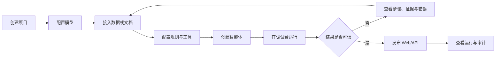
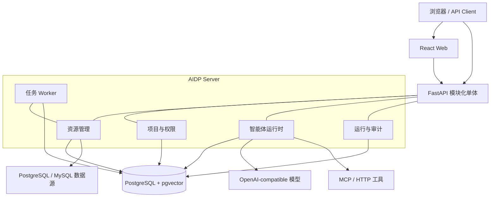

# AIDP 轻量智能决策平台产品需求文档

| 文档项 | 内容 |
| --- | --- |
| 产品名称 | AIDP（暂定，轻量智能决策平台） |
| 文档版本 | V0.1 |
| 文档状态 | 评审草案 |
| 创建日期 | 2026-07-29 |
| 目标版本 | MVP V0.1 |
| 目标读者 | 产品、研发、测试、实施、开源贡献者 |

## 1. 执行摘要

AIDP 面向需要在企业内部快速搭建智能决策应用的开发者、实施人员和业务专家。平台以“一个场景、少量配置、一天跑通”为首要体验，把结构化数据、非结构化知识、业务规则、外部工具和大模型组织为可发布、可追溯的智能体应用。

产品不复刻大而全的数据治理、知识图谱或智能体中台。MVP 采用模块化单体架构，默认只依赖 PostgreSQL（含 pgvector），通过 Docker Compose 启动 Web、Server、Worker 和 Database。平台核心代码及必选依赖采用开源方案；模型层兼容 OpenAI-compatible API，可连接云端模型，也可连接 Ollama、vLLM、SGLang 等本地服务。

MVP 的成功标准不是菜单数量，而是用户能否在 60 分钟内完成一条真实链路：创建项目 → 接入数据或文件 → 配置规则/工具 → 创建智能体 → 调试并看到证据链 → 发布为 Web/API。

## 2. 背景与问题

### 2.1 背景

现有 IDP 已覆盖数据连接、业务对象模型、知识网络、指标与质量、Skills、MCP、智能体、发布和运营等完整能力。完整平台适合企业级复杂建设，但也带来较高的部署、理解、开发和交付成本。对于单场景试点、小团队研发、私有化演示和二次开发，用户往往只需要其中的一条最小闭环。

本项目基于以下判断启动：

1. 大多数早期项目首先需要验证场景价值，而不是先建设完整中台。
2. 数据库、向量检索、任务状态、配置和审计可以在早期统一由 PostgreSQL 承载。
3. 业务对象与关系需要被表达，但不必在 MVP 中引入独立图数据库和重型建模体系。
4. 智能体需要可控、可追溯，但不必依赖复杂的多层编排平台。
5. 开源项目的首要竞争力应是易读、易改、易部署，而不是组件数量。

### 2.2 核心问题

| 问题 | 现象 | 对用户的影响 |
| --- | --- | --- |
| 部署过重 | 多服务、多中间件、环境依赖复杂 | 首次启动和私有化交付耗时长 |
| 概念过多 | 数据源、模型、知识网络、技能、工具等对象层级深 | 新用户学习和排错成本高 |
| 场景交付链路长 | 同一场景需跨多个模块创建和发布资源 | 演示与试点迭代慢 |
| 二次开发困难 | 服务边界多、调用链长、版本协同复杂 | 小团队难以维护自己的分支 |
| 结论可信度不足 | 通用聊天应用难以展示数据、规则与工具证据 | 高价值业务场景难以落地 |

### 2.3 产品机会

AIDP 在“通用聊天/RAG 工具”和“完整企业智能决策中台”之间提供一个开源、轻量、可扩展的选择：保留企业决策所需的证据、规则、权限和审计能力，同时把默认部署和核心概念压缩到最低。

## 3. 产品定位

### 3.1 一句话定位

用一套可读、可改、可单机运行的开源软件，把企业数据、知识、规则和工具快速组装成可追溯的智能决策应用。

### 3.2 产品愿景

让一个熟悉 Python/SQL 的开发者，无需平台专项培训，也能在一天内完成一个真实企业智能决策场景的搭建、发布和排错。

### 3.3 核心原则

1. **场景优先**：所有资源归属项目，用户围绕一个业务场景工作。
2. **最少依赖**：默认只引入不可替代的基础组件。
3. **配置即文件**：关键配置可导出为 YAML/JSON，便于版本管理和迁移。
4. **代码可逃生**：界面能做的配置有对应 API；配置不足时允许用 Python 扩展。
5. **证据优先**：回答必须能回溯到数据行、文档片段、规则命中或工具返回。
6. **安全默认**：查询可自动执行，写入或流程动作默认需要人工确认。
7. **渐进增强**：先让单机 MVP 好用，再增加高可用和企业治理能力。

### 3.4 产品边界

AIDP 是：

- 智能决策场景的配置、运行、调试和发布工具；
- 数据查询、文档检索、规则判断与工具调用的统一智能体运行时；
- 适合开发、演示、试点和中小规模私有化使用的开源基础软件。

AIDP 不是：

- 全量数据治理、主数据管理或数据仓库平台；
- 通用低代码/BPM 平台；
- 完整知识图谱生产与治理平台；
- 大模型训练、微调或推理集群管理平台；
- 允许智能体无审批操作生产系统的 RPA 平台；
- 为追求高并发而预先拆分的微服务集合。

## 4. 目标与非目标

### 4.1 MVP 目标

| 编号 | 目标 | 衡量方式 |
| --- | --- | --- |
| G1 | 降低部署门槛 | 全新环境执行不超过 3 条命令，15 分钟内进入登录页 |
| G2 | 缩短首个场景搭建时间 | 具备样例数据时，60 分钟内完成可对话应用 |
| G3 | 建立最小决策闭环 | 一次运行可组合数据/知识、规则、工具，并生成证据链 |
| G4 | 支持二次开发 | 核心模块边界清晰，新增一种工具或连接器不修改运行时主流程 |
| G5 | 支持私有部署 | 无强制外部 SaaS 依赖，可连接本地模型端点 |
| G6 | 保证可追溯性 | 每次运行保存输入、步骤、证据、输出、耗时和操作者 |

### 4.2 MVP 非目标

- 不支持 Kubernetes 生产编排和跨地域高可用。
- 不建设独立数据目录、血缘、主数据、元数据审批流。
- 不提供可视化知识图谱编辑器和复杂图推理。
- 不支持任意拖拽式工作流编排；仅提供线性智能体循环和固定的确认节点。
- 不提供多智能体群聊、自治任务分解和长周期无人值守执行。
- 不追求海量文档、百亿级向量或千级并发。
- 不在首版内置模型训练、标注和评测集市场。

## 5. 目标用户

| 用户 | 主要诉求 | 典型任务 |
| --- | --- | --- |
| AI/后端开发者 | 快速集成企业数据和模型，保留代码扩展能力 | 开发连接器、工具、智能体，接入业务系统 |
| 解决方案/实施人员 | 用少量配置快速交付可演示场景 | 导入材料、配置规则、发布应用、排查运行链路 |
| 业务专家 | 校验数据口径、规则和智能体结论 | 维护规则、查看证据、确认敏感动作、反馈结果 |
| 平台管理员 | 控制用户、模型、凭证和审计 | 管理成员、密钥、资源权限与运行记录 |

MVP 的主用户是 AI/后端开发者和实施人员。业务专家使用简化的规则、测试与审核界面；复杂治理能力后置。

## 6. 典型场景

### 6.1 合同风险审核

用户上传合同并选择项目。智能体抽取条款，查询交易对手与历史合同数据，匹配制度规则，必要时调用外部尽调工具，最终输出风险等级、命中规则、引用证据和修改建议。发起审批属于写操作，需用户确认后执行。

### 6.2 采购流程合规检查

用户输入项目或流程编号。智能体查询采购金额、供应商、审批节点和附件状态，根据金额阈值与制度规则判断流程是否完整，并列出缺失材料、异常节点和处置建议。

### 6.3 经营指标问数

用户用自然语言询问某一指标。智能体只在授权的数据集和已定义指标中生成只读 SQL，返回数据、口径、时间范围、SQL 摘要和可核验来源。

### 6.4 运维故障辅助

用户描述故障或输入设备编号。智能体组合设备台账、告警数据、运维手册和诊断 API，输出可能原因、证据、排查步骤；创建工单需人工确认。

## 7. MVP 核心用户旅程



首屏应直接呈现上述旅程，不要求用户理解底层模块拓扑。新项目创建后提供一份可运行样例，用户可以替换数据逐步学习。

## 8. 信息架构

平台一级导航控制在 6 项以内：

1. **项目**：项目列表、概览、成员和环境配置。
2. **资源**：数据集、知识库、规则、工具统一管理。
3. **智能体**：创建、配置、版本和发布。
4. **调试台**：对话、输入变量、步骤、证据和日志。
5. **运行记录**：调用记录、失败原因、审批和反馈。
6. **系统设置**：模型供应商、用户、密钥和系统状态。

同一资源只保留一个权威配置入口，避免“创建在 A、发布在 B、授权在 C”的跨模块链路。

## 9. 功能需求

优先级定义：P0 为 MVP 必须具备；P1 为 MVP 后首批增强；P2 为远期候选。

### 9.1 项目与成员

| 编号 | 优先级 | 需求 |
| --- | --- | --- |
| PROJ-01 | P0 | 创建、编辑、归档项目；名称在工作区内唯一 |
| PROJ-02 | P0 | 项目包含资源、智能体、运行记录和成员，不允许资源跨项目隐式引用 |
| PROJ-03 | P0 | 提供管理员、编辑者、查看者三种项目角色 |
| PROJ-04 | P0 | 新项目可选择“空白项目”或“示例项目” |
| PROJ-05 | P1 | 项目一键导出/导入，配置采用可读的 YAML/JSON，密钥不随包导出 |
| PROJ-06 | P2 | 组织、空间、跨项目公共资源库与资源审批 |

验收要点：

- 编辑者可以管理项目资源但不能管理全局模型密钥。
- 查看者不能修改配置或执行待确认动作。
- 归档项目后停止其公开入口，但保留历史运行记录。

### 9.2 模型供应商

| 编号 | 优先级 | 需求 |
| --- | --- | --- |
| MODEL-01 | P0 | 支持配置 OpenAI-compatible Chat Completions/Responses 端点 |
| MODEL-02 | P0 | 模型配置包含名称、Base URL、模型 ID、密钥、上下文长度和超时 |
| MODEL-03 | P0 | 保存前执行连通性测试，密钥加密存储且界面不回显 |
| MODEL-04 | P0 | 分别指定默认对话模型与向量模型 |
| MODEL-05 | P1 | 支持按项目限制可用模型，并记录 token 用量和估算成本 |
| MODEL-06 | P2 | 路由、熔断、限流和多模型自动降级 |

MVP 不自带模型推理服务，只负责连接模型端点。离线部署文档应提供 Ollama/vLLM/SGLang 示例。

### 9.3 数据集与语义配置

“数据集”是 MVP 中结构化数据的统一概念。它包含连接、允许访问的表或视图、字段说明、关系、指标和权限，不引入独立的知识网络产品层。

| 编号 | 优先级 | 需求 |
| --- | --- | --- |
| DATA-01 | P0 | 支持 PostgreSQL、MySQL 只读连接 |
| DATA-02 | P0 | 支持上传 CSV/XLSX，导入平台 PostgreSQL 的项目隔离 schema |
| DATA-03 | P0 | 扫描用户勾选的表、字段、类型和主外键，不默认扫描整个实例 |
| DATA-04 | P0 | 用户可编辑表/字段业务名称、说明、枚举和敏感级别 |
| DATA-05 | P0 | 用户可配置表关系、常用筛选条件和指标公式 |
| DATA-06 | P0 | 提供 SQL 预览与测试；运行时仅允许 SELECT/CTE，设置行数和超时上限 |
| DATA-07 | P0 | 查询证据包含数据集、表/视图、字段、查询时间和结果摘要 |
| DATA-08 | P1 | 支持 REST API 数据源、定时同步和数据质量规则 |
| DATA-09 | P2 | Oracle、SQL Server、ClickHouse、数据血缘与跨源联邦查询 |

验收要点：

- 数据库凭证不进入智能体上下文或前端响应。
- SQL 经解析器校验后执行，禁止 DDL、DML、多语句和未授权对象访问。
- 超过返回上限时给出明确提示，不静默截断后生成确定性结论。

### 9.4 知识库

| 编号 | 优先级 | 需求 |
| --- | --- | --- |
| KNOW-01 | P0 | 支持 PDF、DOCX、Markdown、TXT 文件上传 |
| KNOW-02 | P0 | 提取正文、标题、页码/段落和文件元数据，失败任务可重试 |
| KNOW-03 | P0 | 支持按字符数切分、向量化并写入 pgvector |
| KNOW-04 | P0 | 检索支持向量相似度与 PostgreSQL 全文检索的混合排序 |
| KNOW-05 | P0 | 回答引用可定位到文件、页码或段落，并展示原文片段 |
| KNOW-06 | P0 | 文件更新后生成新版本，历史运行仍指向原版本证据 |
| KNOW-07 | P1 | 支持网页、对象存储目录、OCR 和自定义解析器 |
| KNOW-08 | P2 | 知识审批、去重、自动标签和跨库知识治理 |

### 9.5 规则

规则用于表达必须确定执行的业务判断，不让大模型临时猜测阈值和逻辑。

| 编号 | 优先级 | 需求 |
| --- | --- | --- |
| RULE-01 | P0 | 创建条件规则：名称、说明、适用对象、条件、结论、风险级别和依据 |
| RULE-02 | P0 | 支持 `=、!=、>、>=、<、<=、in、contains、is empty` 和 AND/OR 组合 |
| RULE-03 | P0 | 提供表单编辑和 JSON/YAML 预览，不执行任意用户代码 |
| RULE-04 | P0 | 支持用样例输入单条或批量测试规则 |
| RULE-05 | P0 | 每次命中记录规则版本、输入摘要、结果和依据 |
| RULE-06 | P1 | 决策表、规则组优先级、生效时间与审批发布 |
| RULE-07 | P2 | 复杂规则语言、事件流规则和外部规则引擎适配 |

### 9.6 工具与 MCP

| 编号 | 优先级 | 需求 |
| --- | --- | --- |
| TOOL-01 | P0 | 支持配置 HTTP 工具：方法、URL、请求 schema、响应映射和超时 |
| TOOL-02 | P0 | 支持连接 MCP Server，并同步可用工具及其输入 schema |
| TOOL-03 | P0 | 工具分为查询、生成、写入、流程四类 |
| TOOL-04 | P0 | 写入类和流程类默认需要人工确认；确认页展示工具、参数和风险提示 |
| TOOL-05 | P0 | 密钥使用项目 Secret 引用，日志和模型上下文中自动脱敏 |
| TOOL-06 | P0 | 调试模式可输入样例参数，查看原始请求、响应、耗时和错误 |
| TOOL-07 | P1 | Python 插件工具，使用受限容器或独立进程执行 |
| TOOL-08 | P2 | 工具市场、OAuth 授权和细粒度出站网络策略 |

### 9.7 智能体

| 编号 | 优先级 | 需求 |
| --- | --- | --- |
| AGENT-01 | P0 | 创建智能体：名称、描述、系统指令、模型、欢迎语和示例问题 |
| AGENT-02 | P0 | 从当前项目选择数据集、知识库、规则和工具作为可用能力 |
| AGENT-03 | P0 | 运行时支持“理解问题—选择能力—调用—汇总—引用证据”的受限循环 |
| AGENT-04 | P0 | 单次运行的最大步骤数、最大耗时和 token 上限可配置 |
| AGENT-05 | P0 | 对无法获得证据、证据冲突、数据过期和工具失败给出显式提示 |
| AGENT-06 | P0 | 每次保存产生不可变版本；发布入口绑定指定版本 |
| AGENT-07 | P0 | 支持流式输出、停止生成和重新运行 |
| AGENT-08 | P1 | 结构化输出 schema、会话变量、记忆策略和定时任务 |
| AGENT-09 | P2 | 多智能体协作、可视化任意工作流和长周期自治运行 |

运行时约束：

- 默认最大 8 个步骤、120 秒；超限后停止并返回已完成步骤。
- 工具参数必须通过 schema 校验，不允许模型直接拼接未校验请求。
- 模型生成内容与真实工具结果分开存储，界面可明确区分。
- 结论中的引用必须指向本次运行已获取的证据对象。

### 9.8 调试、证据与评测

| 编号 | 优先级 | 需求 |
| --- | --- | --- |
| DEBUG-01 | P0 | 调试台同时展示对话区和步骤时间线 |
| DEBUG-02 | P0 | 每一步展示类型、输入摘要、输出摘要、耗时、状态和错误 |
| DEBUG-03 | P0 | 证据面板统一展示数据行、文档片段、规则命中和工具响应 |
| DEBUG-04 | P0 | 支持对结果点赞/点踩并填写反馈 |
| DEBUG-05 | P0 | 支持复制运行 ID 和导出单次运行 JSON |
| DEBUG-06 | P1 | 创建测试集，批量运行并对引用完整率、规则命中和人工评分统计 |
| DEBUG-07 | P2 | 模型对比、自动评审、提示词优化建议和线上 A/B 测试 |

### 9.9 发布与访问

| 编号 | 优先级 | 需求 |
| --- | --- | --- |
| PUB-01 | P0 | 智能体可发布为平台内 Web 对话页 |
| PUB-02 | P0 | 可生成项目级 API Key，通过 REST API 创建会话和发送消息 |
| PUB-03 | P0 | API Key 只显示一次，可撤销、设置有效期并记录最后使用时间 |
| PUB-04 | P0 | 发布、更新版本和下线均记录操作者与时间 |
| PUB-05 | P1 | 可嵌入 Chat Widget，支持品牌色和欢迎语配置 |
| PUB-06 | P2 | 多环境发布、灰度、限流套餐和公开应用市场 |

### 9.10 运行记录、审批与审计

| 编号 | 优先级 | 需求 |
| --- | --- | --- |
| OPS-01 | P0 | 按项目、智能体、状态、用户和时间筛选运行记录 |
| OPS-02 | P0 | 运行详情保留模型、智能体版本、步骤、证据、错误和耗时 |
| OPS-03 | P0 | 待确认动作支持批准或拒绝，并记录意见 |
| OPS-04 | P0 | 写操作执行后记录实际请求、脱敏响应和执行状态，禁止伪造成功 |
| OPS-05 | P0 | 配置变更、密钥操作、发布和成员操作进入审计日志 |
| OPS-06 | P1 | 重试、取消后台任务，提供基础用量与错误率看板 |
| OPS-07 | P2 | 告警通知、审计归档、SIEM 对接和自定义留存策略 |

## 10. 关键交互要求

### 10.1 项目概览

项目概览不展示空泛统计，应展示完成最小闭环所需的检查清单：

- 模型是否可用；
- 至少一个数据集或知识库是否就绪；
- 是否存在可测试的智能体；
- 最近一次运行是否成功；
- 是否存在待确认动作或失败任务。

### 10.2 调试台

桌面端采用三栏布局：左侧为会话与输入，中间为回答，右侧为步骤与证据。窄屏时步骤与证据收进抽屉。用户点击回答引用时，右侧定位到对应证据，不跳出当前对话。

### 10.3 错误呈现

错误必须包含：失败阶段、用户可读原因、可执行的解决建议和运行 ID。调试者可以展开技术详情，但普通使用者默认不看到堆栈、密钥或数据库连接信息。

### 10.4 空状态与示例

所有核心资源的空状态都提供一个可运行示例或最短创建路径。示例项目应包含一份小型采购数据、两条制度规则、一份 Markdown 制度文档和一个 Mock HTTP 工具，以演示完整证据链。

## 11. 技术方案建议

本章是约束研发复杂度的产品级技术决策。具体库版本在技术设计阶段确定。

### 11.1 架构原则

- 采用模块化单体，按领域拆包，不按领域拆服务。
- Web、API 和 Worker 共用一个仓库、一个领域模型和一套迁移脚本。
- 在线请求与后台任务可分进程运行，但不引入独立消息队列；任务状态与抢占锁存入 PostgreSQL。
- 统一使用 PostgreSQL 存储业务数据、配置、审计、全文索引和向量。
- 外部模型、数据库、MCP 与 HTTP 服务均通过适配器接入。
- 首版不引入 Kubernetes、Kafka、RabbitMQ、Redis、Elasticsearch、MinIO、Neo4j 和独立向量数据库。

### 11.2 逻辑架构



### 11.3 建议技术栈

| 层次 | 选择 | 选择理由 |
| --- | --- | --- |
| 前端 | React + TypeScript + Vite + Ant Design | 生态成熟，后台界面开发成本低，避免 SSR 复杂度 |
| 后端 | Python 3.12 + FastAPI + Pydantic | AI 生态完整，API 与 schema 开发直接 |
| ORM/迁移 | SQLAlchemy + Alembic | 成熟、显式、易于维护 |
| 数据库 | PostgreSQL 16 + pgvector | 同时覆盖配置、业务、全文、任务和向量检索 |
| 智能体运行时 | 自研小型 ReAct/Tool loop | 控制行为和数据结构，避免绑定重型编排框架 |
| 文档解析 | PyMuPDF、python-docx | 覆盖 MVP 文件类型，均可本地运行 |
| MCP | 官方开源 MCP Python SDK | 减少协议自实现 |
| 认证 | 本地账号 + Argon2 + JWT/安全 Cookie | MVP 无外部身份系统依赖 |
| 部署 | Docker Compose | 一套命令覆盖开发、演示和单机私有化 |
| 测试 | pytest + Playwright | 覆盖领域逻辑、API 和关键用户旅程 |

### 11.4 默认部署拓扑

默认包含 4 个容器：

1. `web`：静态前端与反向代理；
2. `server`：API 和流式响应；
3. `worker`：文档解析、向量化和后台任务，与 server 使用同一镜像；
4. `postgres`：业务数据、任务、全文索引与向量。

小型开发环境允许把 `server` 和 `worker` 合并为一个进程。模型服务、业务数据库和 MCP Server 是外部依赖，不计入 AIDP 必选组件。

### 11.5 模块边界

后端建议按以下领域包组织：

```text
aidp/
├── apps/
│   ├── web/
│   └── server/
├── aidp/
│   ├── identity/
│   ├── projects/
│   ├── resources/
│   │   ├── datasets/
│   │   ├── knowledge/
│   │   ├── rules/
│   │   └── tools/
│   ├── agents/
│   ├── runtime/
│   ├── runs/
│   └── audit/
├── migrations/
├── examples/
└── deploy/
```

模块之间通过 Python 接口和领域事件协作，禁止直接访问其他模块的私有表模型。只有在出现独立扩缩容、故障隔离或团队所有权的真实需求后，才评估拆服务。

## 12. 核心数据模型

| 实体 | 说明 | 关键关系 |
| --- | --- | --- |
| User | 平台用户 | 属于多个 ProjectMember |
| Project | 场景容器与权限边界 | 拥有所有资源、智能体和运行 |
| Secret | 加密凭证 | 被模型、连接和工具按引用使用 |
| ModelProvider | 模型端点配置 | 被 AgentVersion 或知识库引用 |
| Dataset | 数据连接与语义配置 | 包含 Table、Field、Relation、Metric |
| KnowledgeBase | 文档集合与检索配置 | 包含 Document、DocumentVersion、Chunk |
| RuleSet | 规则集合 | 包含不可变 RuleVersion |
| Tool | HTTP/MCP 工具定义 | 被 AgentVersion 授权 |
| Agent | 智能体身份 | 包含多个 AgentVersion 和 Deployment |
| Run | 一次智能体执行 | 包含 Step、Evidence、Approval、Feedback |
| AuditEvent | 管理与配置操作留痕 | 关联用户、项目、对象和时间 |

所有项目级表必须包含 `project_id`；所有可发布资源必须有不可变版本号；历史运行引用具体版本而非可变草稿。

## 13. 对外 API 草案

MVP 提供 `/api/v1` REST API 和基于 SSE 的流式事件：

| 方法与路径 | 用途 |
| --- | --- |
| `POST /projects` | 创建项目 |
| `POST /projects/{id}/datasets` | 创建数据集 |
| `POST /projects/{id}/knowledge-bases` | 创建知识库 |
| `POST /projects/{id}/tools` | 创建工具 |
| `POST /projects/{id}/agents` | 创建智能体 |
| `POST /agents/{id}/versions` | 保存不可变版本 |
| `POST /agents/{id}/deployments` | 发布指定版本 |
| `POST /deployments/{id}/runs` | 创建运行 |
| `GET /runs/{id}/events` | 订阅流式步骤与输出 |
| `GET /runs/{id}` | 获取运行、步骤与证据 |
| `POST /approvals/{id}/approve` | 批准待确认动作 |
| `POST /approvals/{id}/reject` | 拒绝待确认动作 |

API 错误统一包含 `code`、`message`、`suggestion`、`request_id`；分页、时间和状态枚举使用统一约定。OpenAPI 文档随服务提供。

## 14. 安全与合规

### 14.1 P0 安全基线

- 密钥使用服务端主密钥加密，日志、导出包和 API 响应中不出现明文。
- 外部数据连接默认只读账号；SQL 执行设置语句类型、schema、行数和超时限制。
- 项目资源按 `project_id` 强制过滤，服务层与数据库查询层均校验权限。
- 上传文件校验扩展名、MIME、大小和解析超时，文件名不直接作为存储路径。
- HTTP/MCP 工具实施出站地址校验，默认阻止访问环回地址和云元数据地址，防止 SSRF。
- 模型输出视为不可信输入；工具调用前必须经过 schema、权限与审批策略校验。
- 对登录、API Key 和模型调用设置基础速率限制。
- 审计事件仅追加，不允许普通项目成员修改或删除。

### 14.2 数据留存

MVP 默认保存运行记录 90 天，管理员可修改为 7—365 天。删除项目采用先归档后延迟清理；清理操作写入审计日志。生产部署应支持关闭模型请求内容日志，避免第三方供应商保留敏感数据。

### 14.3 开源要求

- 平台核心代码、前后端构建链和必选运行依赖应使用允许商用和再分发的开源许可证。
- 引入依赖前执行许可证与漏洞扫描，仓库保留 SBOM。
- 第三方模型、OCR、数据库驱动和连接器可能有独立许可证，文档必须逐项说明。
- 建议项目许可证优先评估 Apache-2.0；最终选择需由项目所有者确认。

## 15. 非功能需求

### 15.1 性能

| 指标 | MVP 目标 |
| --- | --- |
| 普通配置 API P95 | 小于 500 ms（不含外部服务） |
| 首个流式 token | 小于 3 秒 + 模型实际首 token 延迟 |
| 普通知识检索 P95 | 10 万文档分块内小于 1 秒 |
| SQL 查询 | 默认超时 30 秒、最多返回 1,000 行 |
| 单次智能体运行 | 默认最多 8 步、120 秒、可手动停止 |
| 文件上传 | 单文件默认不超过 50 MB |
| 并发目标 | 单机支持 20 个并发对话、50 个注册用户 |

### 15.2 可用性与恢复

- 单机部署目标可用性 99.5%，不承诺组件级高可用。
- PostgreSQL 每日备份；提供备份和恢复脚本及演练文档。
- Worker 重启后可重新领取未完成任务，任务需具备幂等键。
- 外部模型或工具失败不得导致运行记录丢失。

### 15.3 可维护性

- 新增连接器或工具适配器应有稳定接口、模板和契约测试。
- 数据库结构只通过 Alembic 迁移变更。
- 核心领域逻辑单元测试覆盖率目标不低于 80%。
- 主分支必须通过 lint、类型检查、单测、依赖漏洞扫描和最小端到端测试。
- 发布版本遵循语义化版本，并提供升级与回滚说明。

### 15.4 可观测性

MVP 使用 JSON 结构化日志、请求 ID、运行 ID和数据库中的步骤记录。健康检查区分存活、就绪和外部依赖状态。Prometheus/OpenTelemetry 导出作为 P1 可选能力，不作为默认部署依赖。

## 16. 产品指标

### 16.1 北极星指标

每周成功完成且包含至少一种可核验证据的智能体运行数。

### 16.2 MVP 指标

| 指标 | 目标 |
| --- | --- |
| 首次部署成功率 | 至少 90% 的测试环境无需人工改代码即可启动 |
| 首个应用完成时间 | 中位数不超过 60 分钟 |
| 运行成功率 | 排除用户主动停止后不低于 95% |
| 引用完整率 | 需要事实依据的结论中，至少 90% 带可打开的证据 |
| 问题可诊断率 | 至少 90% 的失败运行可在界面定位到失败步骤 |
| 升级成功率 | 相邻小版本升级测试 100% 保留配置和历史运行 |

指标默认仅在本地统计。开源项目若收集匿名遥测，必须显式征得管理员同意，并允许完全关闭。

## 17. MVP 范围与版本规划

### 17.1 MVP 必须形成的闭环

MVP 发布前必须同时满足：

1. Docker Compose 全新安装可用；
2. 本地账号、项目和三种角色可用；
3. 至少一种 OpenAI-compatible 对话模型和一种向量模型可用；
4. PostgreSQL/MySQL、CSV/XLSX、PDF/DOCX/Markdown/TXT 接入可用；
5. 数据查询、知识检索、规则判断、HTTP/MCP 工具均可被智能体调用；
6. 写入工具具备确认机制；
7. Web 与 API 发布可用；
8. 运行步骤、证据、错误和审计可查看；
9. 示例项目能在自动化验收中完成端到端运行；
10. 备份、恢复、升级和安全配置文档齐全。

### 17.2 建议里程碑

| 阶段 | 建议周期 | 交付物 | 退出条件 |
| --- | --- | --- | --- |
| M0 工程骨架 | 第 1 周 | 单仓库、Compose、认证、项目、CI | 全新环境可登录并创建项目 |
| M1 资源接入 | 第 2—3 周 | 模型、数据集、知识库、规则、工具 | 各资源可独立测试并产生证据 |
| M2 智能体闭环 | 第 4 周 | 运行时、调试台、版本、运行记录 | 示例智能体可完成四类能力调用 |
| M3 发布与安全 | 第 5 周 | Web/API 发布、审批、权限、审计 | 写操作确认和项目隔离通过测试 |
| M4 稳定与开源 | 第 6 周 | E2E、文档、样例、备份升级、许可证清单 | 新用户按 README 独立完成样例 |

周期以 3—4 名熟悉栈的研发并行投入为假设，不包含视觉品牌设计、国产化适配和复杂企业 SSO。

### 17.3 P1 候选

- 项目配置包导入导出与 Git 同步；
- 测试集、批量评测和基础质量看板；
- REST 数据源、OCR、网页采集；
- Python 插件工具沙箱；
- OIDC/LDAP 单点登录；
- OpenTelemetry/Prometheus 指标导出；
- 嵌入式 Chat Widget；
- 单独对象存储和 Redis 的可选扩展配置。

## 18. 验收方案

### 18.1 黄金路径验收

使用仓库内示例项目执行以下测试：

1. 管理员配置模型并邀请一名编辑者。
2. 编辑者导入采购 XLSX、制度 Markdown 和两条合规规则。
3. 编辑者配置一个供应商查询 Mock HTTP 工具和一个待确认的“创建整改任务”工具。
4. 编辑者创建智能体并提问：“项目 P-001 是否满足采购审批要求？”
5. 智能体查询数据、检索制度、执行规则、查询工具并输出结论。
6. 回答展示至少一条数据证据、一条文档引用、一条规则命中和一次工具响应。
7. 智能体提出创建整改任务，界面阻止直接执行并等待确认。
8. 用户批准后工具执行，运行与审计中可查到确认人、参数和结果。
9. 发布指定版本，通过 API Key 重复调用并获取流式输出。

### 18.2 失败路径验收

- 模型端点不可用：明确显示供应商、错误类型和重试建议。
- SQL 包含写操作：执行前被拒绝并记录安全事件。
- 文档解析失败：任务可重试，不生成“已就绪”的错误状态。
- 工具返回超时或无效 schema：运行保留已完成步骤并标注失败。
- 用户跨项目访问资源：API 返回 404/403，不泄露资源是否存在。
- Worker 在任务中途重启：任务恢复或明确失败，不重复写入文档分块。
- 证据不足：智能体明确回答无法判断，不生成伪造引用。

## 19. 风险与应对

| 风险 | 影响 | 应对 |
| --- | --- | --- |
| “轻量”演变为功能缩水 | 场景无法真正闭环 | 以黄金路径和证据链作为范围底线 |
| PostgreSQL 承担过多职责 | 数据量增大后性能下降 | 建立容量指标；达到阈值后再引入可选专用组件 |
| 自研智能体循环能力不足 | 工具选择和恢复效果差 | 保持运行时小而可测试；建立标准事件协议和适配层 |
| Text-to-SQL 误查或泄露 | 数据安全风险 | 白名单、AST 校验、只读账号、行列限制、审计和超时 |
| Prompt Injection 触发危险工具 | 越权操作 | 工具授权、参数校验、写操作确认、内容与指令分离 |
| 文档解析质量不稳定 | 引用错误、答案失真 | 保存解析预览、版本与页码；允许用户修正和重建 |
| 依赖许可证不兼容 | 开源与商用受阻 | 合入前许可证扫描、SBOM 和人工审查 |
| 需求继续平台化膨胀 | 研发复杂度失控 | 新组件必须证明现有方案无法满足量化指标后才引入 |

## 20. 需要产品所有者确认的决策

以下问题不阻塞 PRD V0.1 评审，但应在 M0 结束前确定：

1. AIDP 的英文全称、中文正式名称和品牌定位。
2. 开源许可证采用 Apache-2.0、AGPL-3.0，还是其他策略。
3. 首个必须打磨的标杆场景：合同审核、采购合规、经营问数或其他。
4. 首发是否必须支持纯离线安装和国产 CPU/操作系统。
5. 是否接受 MVP 仅本地账号，还是首版必须提供 OIDC/LDAP。
6. 默认数据留存期限、单文件大小和单机容量目标是否符合真实客户环境。
7. 模型协议是否只保证 OpenAI-compatible，是否需首版直接适配特定国产模型厂商。
8. 开源版与未来商业版是否区分；若区分，能力边界是什么。

## 21. 轻量化决策清单

任何新增平台能力在进入 P0/P1 前，需要回答以下问题：

1. 它是否直接缩短黄金路径，或解决明确的安全/可靠性问题？
2. 现有 PostgreSQL、模块化单体或适配器是否确实无法满足？
3. 新增组件是否会增加安装、升级、备份和排错步骤？
4. 若增加复杂度，是否有量化容量或用户证据支持？
5. 它能否作为可选扩展，而不是默认依赖？

若第 1 题为否，或第 4 题无证据，该能力不进入当前版本。

---

本 PRD 的核心取舍是：AIDP 保留智能决策平台区别于普通聊天应用的“数据、知识、规则、工具、证据、审批、审计”闭环，但主动放弃早期不必要的平台化、微服务化和中间件堆叠。评审通过后，下一步应先产出技术设计、交互原型和黄金路径示例数据，再开始工程实现。
