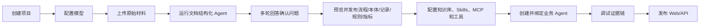

# AIDP 操作手册（MVP 设计稿）

| 文档项 | 内容 |
| --- | --- |
| 对应产品 | AIDP 轻量智能决策平台 |
| 对应 PRD | V0.2 |
| 手册版本 | V0.1 |
| 创建日期 | 2026-07-29 |
| 适用对象 | 管理员、实施人员、流程负责人、业务专家、Agent 开发者 |

> 本手册描述 PRD V0.2 规划的目标产品操作流程。当前仓库仍处于产品设计阶段，文中的页面、按钮和状态是后续研发与验收的统一依据，不代表功能已经实现。

## 1. 先了解整个流程

当客户没有线上管理系统、只有制度、流程、表单、台账和邮件时，推荐按以下顺序工作：



不要在上传文件后直接创建业务 Agent。先完成结构化发布，Agent 才能稳定使用明确的流程、对象、字段、规则和指标，而不是每次临时理解同一批文档。

## 2. 用户角色与职责

| 角色 | 主要职责 | 不允许的操作 |
| --- | --- | --- |
| 系统管理员 | 配置模型、用户、全局安全和系统状态 | 不应代替业务负责人确认业务口径 |
| 项目管理员 | 管理项目成员、Secrets、发布和归档 | 不能查看无权访问项目的数据 |
| 编辑者/实施人员 | 上传材料、配置资源、处理草稿、调试 Agent | 不能管理全局模型密钥 |
| 流程负责人/业务专家 | 回答问题，确认流程、规则、指标和发布内容 | 默认不能修改系统和外部连接配置 |
| 查看者 | 查看已发布资产、运行和证据 | 不能修改配置、发布或批准动作 |

建议至少由一名实施人员和一名业务负责人共同完成第一次结构化任务。实施人员负责材料与配置，业务负责人对业务事实负责。

## 3. 使用前准备

### 3.1 环境检查

管理员进入“系统设置 → 系统状态”，确认：

- Web、Server、Worker、PostgreSQL 状态均为“正常”；
- 默认对话模型与向量模型已配置；
- 本地文件存储剩余空间充足；
- 若使用扫描件，本地 OCR 能力处于“可用”；
- 若使用 OpenCode Runtime，可选的 OpenCode Provider 状态为“可用”；
- 若使用外部 RAGFlow，Knowledge Provider 健康检查通过。

任一必选组件异常时，不要开始大批量上传。先打开组件详情，按错误建议修复。

### 3.2 准备材料

推荐按业务主题整理材料，而不是把客户全部共享盘一次性上传。首个任务控制在 20—50 个文件内，至少准备：

- 一份流程或制度主文档；
- 相关岗位职责或审批权限；
- 实际使用的申请表、检查表或登记表；
- 少量历史记录或 Excel 台账；
- 对主文档的补充通知、邮件或常见问题；
- 已知的业务负责人名单。

上传前无需人工把材料重写成统一模板，但应移除明显无关文件和真实密钥。文件名与目录会作为分类线索，不建议全部改成无意义编号。

### 3.3 选择标杆范围

第一次只选择一个边界清楚的流程，例如“采购申请到合同签订”，不要直接选择“整个采购管理”。范围越大，Agent 需要确认的问题越多，业务负责人越难一次定稿。

## 4. 创建项目

1. 打开“项目”，点击“新建项目”。
2. 输入项目名称、说明和默认时区。
3. 选择创建方式：
   - “空白项目”：用于真实客户材料；
   - “采购流程示例”：用于学习完整流程。
4. 选择数据留存期限，MVP 默认 90 天运行记录。
5. 添加项目成员，并设置管理员、编辑者或查看者角色。
6. 点击“创建”。

创建后，项目概览会显示一份完成清单。对于没有线上系统的客户，第一项应是“上传并结构化原始材料”。

## 5. 配置模型

### 5.1 新建模型供应商

1. 进入“系统设置 → 模型供应商”。
2. 点击“新增 OpenAI-compatible 端点”。
3. 填写名称、Base URL、模型 ID、API Key、上下文长度和超时。
4. 点击“测试连接”。
5. 测试成功后保存。

分别配置：

- 对话/抽取模型：用于文档理解、提问和 Agent 推理；
- 向量模型：用于知识库索引与检索；
- 可选 reranker：用于提高混合检索排序质量。

### 5.2 项目授权

管理员在模型详情中选择允许使用该模型的项目。项目编辑者只能看到模型名称和能力，不能看到 API Key。

### 5.3 选择模型的建议

- 文档结构化需要稳定的结构化输出和较长上下文，不要只按单价选择模型。
- 敏感材料优先连接本地 OpenAI-compatible 服务。
- 更换向量模型后需要重建相关知识库索引；已发布版本仍应保留原索引引用。

## 6. 上传原始材料

### 6.1 创建材料批次

1. 进入项目的“结构化工作台”。
2. 点击“上传材料”。
3. 拖入文件、文件夹或 ZIP，也可以分多次补充。
4. 选择材料批次名称，例如“采购管理制度及历史台账 2026-07”。
5. 选择是否同时准备进入知识库。此时只记录意图，不立即建立最终索引。
6. 点击“开始上传”。

MVP 直接支持 PDF、DOCX、PPTX、XLSX、CSV、Markdown、TXT、HTML、常见图片和 EML。旧版 DOC/XLS/PPT 需要管理员启用 LibreOffice 转换 Profile。

### 6.2 检查上传结果

材料列表显示：文件类型、大小、哈希、上传人、解析状态、文档分类和版本关系。

重点处理以下状态：

| 状态 | 含义 | 操作 |
| --- | --- | --- |
| 待解析 | 文件已保存，Worker 尚未处理 | 正常等待 |
| 解析中 | 正在生成 Document IR | 可查看实时阶段，不要重复上传 |
| 待复核 | OCR、表格或版面置信度偏低 | 打开预览并标记正确内容 |
| 可能重复 | 哈希或内容与已有版本相似 | 选择“作为新版本”“保留两份”或“忽略” |
| 内容冲突 | 同一主题存在不同规定 | 保留两份，交给结构化任务确认适用关系 |
| 解析失败 | 格式、密码、损坏或资源问题 | 查看原因，修复文件后重试 |

### 6.3 查看 Document IR

点击文件后切换“原文 / 解析结果”。确认：

- 标题层级与阅读顺序正确；
- 表格行列没有明显错位；
- 扫描页文字可读；
- 页码、段落和单元格引用可定位；
- 低置信度区域被明确标记。

原始文件不可直接覆盖。修订文件应上传为新版本，以保证历史证据仍可回放。

## 7. 启动文档结构化 Agent

### 7.1 创建结构化任务

1. 在材料批次右上角点击“开始结构化”。
2. 选择流程模板：

| 模板 | 何时选择 |
| --- | --- |
| 流程与台账结构化 | 客户希望从文档形成流程、对象、字段和最小线上台账 |
| 制度与规则结构化 | 目标是把制度条款转成可执行规则和依据 |
| 指标口径结构化 | 目标是从报表、公式和说明中建立指标模型 |
| 合同/材料抽取 | 已经有明确字段 schema，需要批量抽取对象实例 |

3. 输入本次任务范围、目标和不处理内容。
4. 选择负责人与参与确认人员。
5. 选择 Runtime：
   - “内置”：默认选项，部署最轻；
   - “OpenCode”：管理员已启用 Provider，且需要其持久会话、Skills/MCP 或问题事件能力时使用。
6. 选择或新建本体草稿；第一次可选择“由 Agent 推荐”。
7. 选择允许任务使用的 Skills、MCP 和工具。文档结构化默认不需要写入外部系统。
8. 点击“创建并运行”。

### 7.2 阶段说明

任务按固定阶段推进：

1. **Intake**：核对材料范围、文件状态和任务目标。
2. **Parsed**：确认全部文件已有可用 Document IR。
3. **Classified**：分类材料，识别版本、重复与冲突。
4. **Drafted**：抽取流程、本体、字段、记录、规则和指标候选。
5. **Waiting**：存在需要客户回答的问题，任务暂停。
6. **Validating**：执行 schema、引用、关系、规则和指标校验。
7. **Preview**：形成可发布变更集。
8. **Published**：用户确认后事务发布。

页面关闭、服务重启或任务转交不会丢失状态。不要通过重新创建任务来“继续”，应打开原任务点击“恢复”。

## 8. 处理多轮确认问题

### 8.1 问题类型

| 类型 | 是否阻止发布 | 示例 |
| --- | --- | --- |
| 阻塞 | 是 | “采购金额”是含税金额还是未税金额？ |
| 建议确认 | 默认否 | 制度与邮件不一致，是否按更新日期较晚的邮件处理？ |
| 信息补充 | 否 | 是否补充该流程的 SLA 负责人？ |

每个问题应显示：为什么问、影响哪些草稿、Agent 建议答案、候选选项和原文证据。如果页面只显示问题而没有影响与证据，应视为产品缺陷。

### 8.2 回答方式

1. 打开“待确认问题”。
2. 按证据核对问题，不要只接受 Agent 建议。
3. 选择或输入答案；复杂问题可以直接编辑表格。
4. 必要时上传补充材料。
5. 选择“保存草稿”或“提交本轮答案”。

提交后平台只重新运行受影响阶段，并保留原答案、修改人和修改时间。

### 8.3 示例：采购流程第一轮

Agent 可能提出：

1. 采购流程从“需求提出”还是“采购申请提交”开始？
2. 10 万元审批阈值按单次申请、单个合同还是年度累计金额计算？
3. 制度规定由部门经理审批，补充邮件写“业务负责人”，二者是否为同一角色？
4. Excel 中 `计划金额` 与表单中的 `预算金额` 是否为同一字段？

流程负责人回答后，Agent 可能在第二轮继续问：

1. 紧急采购是否跳过询比价，还是事后补充？
2. 审批周期从提交到最终批准，还是到合同签订？

第二轮问题来自第一轮确定的流程边界，属于正常行为，不应为了减少轮次强行一次性猜测。

### 8.4 跳过、转交和重开

- “暂时跳过”：保留问题，下次继续；阻塞问题仍阻止发布。
- “交给他人”：选择项目成员和截止日期；任务负责人仍能看到状态。
- “采用建议答案”：必须记录由谁接受了 Agent 建议。
- “不适用”：填写原因，关闭问题。
- “重新打开”：已回答问题影响口径时可以重开，相关草稿回到待校验状态。

## 9. 审核结构化草稿

### 9.1 流程图

检查流程名称、起止状态、活动顺序、执行角色、分支条件、异常路径和完成条件。点击任一节点，右侧应显示来源文档与页码。

### 9.2 本体与字段

检查：

- 对象边界是否合理，例如“供应商”不应被误建为“采购项目”的普通文本字段；
- 主键或业务唯一标识是否存在；
- 字段类型、枚举、必填性、敏感级别是否正确；
- 对象关系方向与多重性是否正确；
- Action 是否真的需要执行，是否应要求人工确认。

### 9.3 历史记录

打开“记录预览”，查看从 Excel、表单或合同抽取的对象实例。低置信度字段不得默认为已确认。重复记录先合并候选，不要直接删除。

### 9.4 规则

检查每条规则的条件、结论、风险等级、适用流程环节和制度依据。规则表达不了的复杂逻辑应保留为业务说明或 P1 需求，不要把任意代码塞入规则字段。

### 9.5 指标候选

检查事实来源、度量、聚合方式、时间口径、维度、过滤条件、单位、去重键和空值处理。未确认的指标保持草稿状态。

## 10. 预览并发布变更集

### 10.1 进入发布预览

当所有阻塞问题关闭、校验通过后，点击“生成发布预览”。页面按类型显示：

- 新增；
- 修改；
- 合并；
- 忽略；
- 建议删除。

每项变更都能展开查看新旧差异和证据。删除默认不选中，且不得因为新文档未提及旧对象就自动建议删除。

### 10.2 发布检查

发布前确认：

- 没有未关闭的阻塞问题；
- 关键流程字段均有证据或标记为人工补充；
- 本体关系不存在孤立必填对象；
- 规则引用的字段和流程环节存在；
- 指标能编译并完成样例查询；
- 知识切片预览和引用回链正常；
- 当前用户具有发布权限。

### 10.3 执行发布

1. 填写版本说明。
2. 选择需要发布的资产。
3. 点击“确认发布”。
4. 等待事务完成。

发布成功后会生成统一 `ChangeSet ID`。如果任一资产写入失败，全部正式变更回滚，任务仍停留在 Preview，可以修复后重试。

## 11. 使用最小线上台账

进入“资源 → 本体”，选择一个对象类型，再打开“记录”。可以：

- 按字段筛选和排序记录；
- 查看对象详情及关联对象；
- 从字段值跳转到原文件、页码或单元格；
- 新增或修改记录；
- 查看记录的来源、确认状态和变更历史；
- 执行已授权 Action。

这不是完整低代码系统，而是客户没有业务系统时的最小结构化承载。需要复杂表单、审批和移动端时，应通过 API/MCP 对接专业系统，而不是继续扩张 AIDP 内置台账。

## 12. 配置知识库

### 12.1 使用内置轻量知识库

1. 进入“资源 → 知识库”，点击“新建”。
2. 选择已上传的原始材料，不需要重复上传。
3. 选择切分策略：通用、制度、表格或父子切片。
4. 选择向量模型，可选 reranker。
5. 设置 Top-K、相似度阈值和元数据过滤。
6. 点击“构建索引”。
7. 在“检索测试”输入真实问题，查看命中片段、得分和引用位置。
8. 修订或禁用错误切片，测试通过后发布知识库版本。

默认 Provider 使用 Docling Document IR、PostgreSQL 全文检索和 pgvector。

### 12.2 使用 RAGFlow Provider

仅在客户已有 RAGFlow，或明确需要其复杂版面解析、模板切分和高级检索时使用：

1. 管理员进入“系统设置 → Knowledge Providers”。
2. 新建 RAGFlow 连接，填写 Base URL 和 API Key Secret。
3. 执行健康检查。
4. 在知识库创建页选择“RAGFlow”。
5. 选择远端 Dataset 或由 AIDP 创建新的 Dataset。
6. 构建索引并验证引用回链。

RAGFlow 是外部 Provider，不应被加入 AIDP 默认 4 容器部署。

## 13. 使用 Text-to-Metric

### 13.1 Author：从文本创建指标

1. 进入“资源 → 指标”，点击“用自然语言创建”。
2. 输入指标描述，例如：“采购审批周期，统计每个项目从提交申请到最终审批通过的自然日，中位数按部门和月份展示，驳回后重新提交仍按首次提交时间计算。”
3. 选择来源：已发布本体、数据集字段、流程或文档证据。
4. 点击“生成草稿”。
5. 回答 Agent 关于时间字段、去重键、过滤条件、单位和空值的确认问题。
6. 查看 Metric IR、依赖、编译 SQL 和样例结果。
7. 与业务负责人确认后发布。

发布前必须明确：

- 指标回答的业务问题；
- 事实表或对象；
- 度量及聚合方式；
- 时间字段与时间粒度；
- 可用维度；
- 过滤、去重、单位和空值口径；
- 负责人和口径证据。

### 13.2 Query：查询已发布指标

用户或 Agent 可以提问：“2026 年 7 月各部门采购审批周期中位数是多少？”平台先解析为指标、维度、时间范围和过滤条件，再由确定性编译器生成 SQL。

结果必须展示：指标版本、实际过滤、数据时间、单位、口径、SQL 摘要和来源。找不到已发布指标时，应建议创建指标草稿，而不是直接生成任意 SQL。

## 14. 配置 Skills

### 14.1 创建 Skill

1. 进入“资源 → Skills”，点击“新建”。
2. 填写名称、描述和版本。
3. 编辑 `SKILL.md`，或上传兼容的 Skill 目录。
4. 添加只读模板、示例和参考文件。
5. 运行 schema 和安全检查。
6. 保存为不可变版本并发布。

最小示例：

```markdown
---
name: process-extraction
description: 从制度、流程说明和表单中抽取标准业务流程，并在存在歧义时提出可确认问题
license: Apache-2.0
metadata:
  output-schema: aidp-process-v1
---

# 工作要求

1. 只基于提供的 Document IR 和证据工作。
2. 区分事实、推断和待确认项。
3. 每个关键字段必须带 Evidence Link。
4. 不确定流程边界、角色、条件或指标口径时创建 Confirmation Task。
```

Skill 描述应足够具体，使 Agent 知道何时加载。大段业务材料不要直接塞进 Skill，应放入知识库或只读参考文件。

## 15. 配置 MCP 与工具

### 15.1 连接 MCP Server

1. 进入“资源 → MCP”，点击“新增 Server”。
2. 选择 stdio 或 Streamable HTTP。
3. 配置命令/URL、Secret、超时和出站策略。
4. 点击“连接并同步”。
5. 查看同步得到的 Tools、Prompts、Resources 和输入 schema。
6. 禁用不需要的工具，只发布允许项目使用的能力。

### 15.2 配置 HTTP 工具

1. 进入“资源 → 工具”，点击“新增 HTTP 工具”。
2. 填写方法、URL、请求 schema、响应映射和超时。
3. 选择类型：查询、生成、写入或流程。
4. 写入/流程类保持“需要人工确认”。
5. 使用样例参数测试，核对脱敏请求、真实响应和错误处理。

不要把 Secret 写进 URL、Skill 或 Agent Prompt，统一使用项目 Secret 引用。

## 16. 创建并绑定 Agent

### 16.1 新建 Agent

1. 进入“智能体”，点击“新建”。
2. 填写名称、职责、边界、欢迎语和示例问题。
3. 选择模型与 Runtime Provider。
4. 配置最大步骤、耗时和 token 上限。

### 16.2 绑定资源

在“能力与数据”页按需绑定：

| 类型 | 最少需要确认的范围 |
| --- | --- |
| 本体 | 本体版本、对象类型、read/query/create-draft/update/execute 权限 |
| 数据集 | 数据集版本、表/视图、字段和只读限制 |
| 知识库 | 版本、检索策略和元数据过滤 |
| 指标 | 指标或指标组版本 |
| 规则 | 规则集版本和适用对象 |
| Skill | Skill 固定版本 |
| MCP | Server 与允许的工具白名单 |
| HTTP 工具 | 版本、超时、输入映射和确认策略 |
| 子 Agent | 发布版本、输入映射、超时和是否允许干预 |

点击“校验绑定”。必须修复以下问题后才能保存版本：资源未发布、版本不存在、对象越权、输入 schema 不兼容、MCP 不可用或形成循环依赖。

### 16.3 OpenCode Runtime 注意事项

使用 OpenCode Provider 时：

- 默认禁用 shell、任意文件写入和递归子 Agent；
- 材料与 Skills 以只读方式挂载到一次性任务目录；
- 只暴露 AgentManifest 明确绑定的 MCP/工具；
- OpenCode 的 question/permission 事件必须同步为 AIDP 确认任务；
- AIDP 是项目、资源、版本、问题和审计的权威来源；
- Provider 中断后可以从 AIDP 检查点重试，不能只依赖 OpenCode 本地会话恢复。

## 17. 调试 Agent

1. 保存一个不可变 Agent 版本。
2. 打开“调试与运行”，输入黄金路径问题。
3. 在步骤时间线检查意图识别、Skill 加载、数据/指标/知识检索、规则和工具调用。
4. 点击回答引用，确认能定位原文件、数据行、指标定义、规则或工具响应。
5. 检查模型生成内容与真实工具结果在界面中有明确区分。
6. 触发一个写入工具，确认平台暂停并展示参数，而不是直接执行。
7. 拒绝一次、批准一次，分别核对运行状态和审计日志。
8. 使用证据不足、资源不可用和越权问题测试失败路径。

Agent 无法获得证据时，正确行为是说明无法判断。出现伪造引用或静默使用未绑定资源时，不允许发布。

## 18. 发布 Web 与 API

### 18.1 发布 Web

1. 在 Agent 版本页点击“发布”。
2. 选择 Web 对话页。
3. 设置欢迎语、示例问题和访问成员。
4. 核对绑定资源版本和确认策略。
5. 填写发布说明并确认。

### 18.2 发布 API

1. 创建项目级 API Key。
2. 设置有效期和允许调用的 Deployment。
3. 复制并安全保存 Key；关闭后不再回显。
4. 调用运行 API，并通过 SSE 订阅输出与步骤事件。
5. 在运行记录中确认调用用户、版本和证据完整。

更新 Agent 时应发布新版本。不要直接修改历史版本；回滚时把 Deployment 指回之前的已发布版本。

## 19. 日常运营

### 19.1 运行记录

按项目、Agent、状态、用户和时间筛选。失败记录应能定位到模型、检索、指标、规则、MCP、工具、确认或发布阶段。

### 19.2 待确认动作

审批人打开任务后核对工具、参数、风险提示和触发证据，再批准或拒绝。批准只针对当前参数；参数变化后必须重新确认。

### 19.3 文档更新

1. 上传新文件版本。
2. 创建“增量结构化任务”。
3. 查看它对流程、本体、规则、指标和知识切片的影响。
4. 回答新增冲突问题。
5. 发布新的变更集和资源版本。

不要直接重建并覆盖旧知识库，否则历史 Agent 运行将无法还原引用。

### 19.4 备份与升级

- 按部署手册每日备份 PostgreSQL 和原始文件存储；
- 升级前运行迁移预检并创建备份；
- 升级后抽查一个历史 Structuring Case、一个证据链接和一个 Agent 运行；
- Provider 升级应先在测试项目验证，不直接替换生产连接。

## 20. 常见问题与处理

| 问题 | 优先检查 | 处理 |
| --- | --- | --- |
| 文件长期停在“待解析” | Worker 健康、任务锁、存储空间 | 恢复 Worker 后重试原任务，不重复上传 |
| PDF 文字顺序错误 | 解析策略、版面预览、扫描状态 | 切换 Docling/OCR 配置并生成新 Document IR 版本 |
| Agent 一直重复提问 | 问题是否已提交、答案影响范围、检查点 | 合并重复任务，保留已确认答案，只重跑受影响阶段 |
| 问题太多 | 任务范围、阻塞级别、模板 | 缩小流程边界，批量回答建议项，不降低关键口径确认要求 |
| 发布按钮不可用 | 阻塞问题、schema 校验、权限 | 打开发布检查列表逐项修复 |
| 发布后记录为空 | ChangeSet、对象映射、事务结果 | 查看发布步骤；禁止手工补一半数据，修复后整体重试 |
| 知识检索无结果 | 文档版本、索引状态、向量模型、阈值 | 在检索测试中逐项排查并重建新索引版本 |
| 指标 SQL 无法编译 | 时间字段、实体关系、去重键、数据源方言 | 返回 Author 模式补齐定义，不让模型绕过编译器 |
| MCP 工具没有出现 | Server 状态、工具同步、Agent 白名单 | 重新同步并显式授权目标工具 |
| OpenCode 会话中断 | Provider 状态、AIDP 检查点、待确认事件 | 从 Structuring Case 恢复或切换内置 Runtime |
| Agent 给出无证据结论 | 绑定范围、检索结果、Prompt | 视为阻塞缺陷，修复后重新发布版本 |
| 写入工具直接执行 | 工具类型、确认策略、Runtime 权限 | 立即停用 Deployment，修复策略并审计相关调用 |

## 21. 首次交付验收清单

文档结构化：

- [ ] 多类型材料全部有明确解析状态。
- [ ] 流程、对象、字段、规则和指标草稿可以定位原文证据。
- [ ] Agent 至少完成两轮问题确认，刷新或重启后状态不丢失。
- [ ] 阻塞问题未关闭时无法发布。
- [ ] 发布失败会整体回滚。
- [ ] 发布后能在最小台账查看结构化记录和字段证据。

知识与指标：

- [ ] 知识库通过至少 5 个真实问题的检索测试。
- [ ] 引用可定位文件版本、页码/段落/表格。
- [ ] 至少一个 Text-to-Metric 指标完成口径确认、编译和样例查询。
- [ ] 指标查询返回版本、过滤、时间、单位和证据。

Agent：

- [ ] 本体、数据集、知识库、指标、规则、Skill、MCP 和工具绑定校验通过。
- [ ] 未绑定资源不会暴露给 Agent。
- [ ] 写入或流程工具会暂停并等待人工确认。
- [ ] 调试台能展示完整步骤、证据和错误。
- [ ] Web 与 API 均调用固定的已发布 Agent 版本。
- [ ] 审计日志能还原上传、回答、修订、发布、确认和执行人。

## 22. 术语速查

| 术语 | 含义 |
| --- | --- |
| Raw Asset | 用户上传的原始文件及其版本 |
| Document IR | 解析器生成的统一文档结构，保留段落、表格、图片和定位信息 |
| Structuring Case | 一次可暂停、恢复和多轮确认的文档结构化任务 |
| Confirmation Task | 具备负责人、状态、证据和影响范围的独立问题 |
| ChangeSet | 发布前的结构化资产新增、修改、合并和删除集合 |
| Ontology | 对象类、属性、关系类和行动类组成的业务语义模型 |
| Business Record | 按本体保存、且能回溯来源的结构化对象实例 |
| Metric IR | 可版本化、可校验、可编译的指标中间表示 |
| Skill | Agent 按需加载的可复用业务指令包 |
| MCP | Agent 发现和调用外部工具、资源、提示的标准协议 |
| AgentManifest | Agent 运行时、模型、资源版本、权限、超时和确认策略的统一清单 |
| Evidence Link | 结构化字段或 Agent 结论到原文件、数据行、规则、指标或工具响应的引用 |
