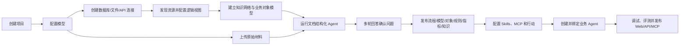

# AIDP 完整产品操作手册（设计稿）

| 文档项 | 内容 |
| --- | --- |
| 对应产品 | AIDP 轻量智能决策平台 |
| 对应 PRD | V0.3 |
| 手册版本 | V0.2 |
| 创建日期 | 2026-07-29 |
| 适用对象 | 管理员、实施人员、流程负责人、业务专家、Agent 开发者 |

> 本手册描述 PRD V0.3 的完整产品操作流程，不按 MVP 裁剪。当前仓库仍处于产品设计阶段，文中的页面、按钮和状态是后续研发与验收的统一依据，不代表功能已经实现。

## 1. 先了解整个流程

当客户没有线上管理系统、只有制度、流程、表单、台账和邮件时，推荐按以下顺序工作：



客户只有文档时，可以先走上传与结构化路线；客户同时有数据库、Excel 台账或 API 时，应先登记连接和资源，再把文档语义与结构化数据映射到同一知识网络。不要直接创建业务 Agent，先发布数据资源、对象模型、知识、指标和规则，Agent 才能使用稳定、可授权、可追溯的语义资产。

## 2. 用户角色与职责

| 角色 | 主要职责 | 不允许的操作 |
| --- | --- | --- |
| 系统管理员 | 配置模型、用户、全局安全和系统状态 | 不应代替业务负责人确认业务口径 |
| 项目管理员 | 管理项目成员、Secrets、发布和归档 | 不能查看无权访问项目的数据 |
| 编辑者/实施人员 | 上传材料、配置资源、处理草稿、调试 Agent | 不能管理全局模型密钥 |
| 流程负责人/业务专家 | 回答问题，确认流程、规则、指标和发布内容 | 默认不能修改系统和外部连接配置 |
| 查看者 | 查看已发布资产、运行和证据 | 不能修改配置、发布或批准动作 |

建议至少由一名实施人员和一名业务负责人共同完成第一次结构化任务。实施人员负责材料与配置，业务负责人对业务事实负责。

## 3. 使用前准备

### 3.1 环境检查

管理员进入“系统设置 → 系统状态”，确认：

- Web、Server、Worker、PostgreSQL 状态均为“正常”；
- 默认对话模型与向量模型已配置；
- 本地文件存储剩余空间充足；
- 若使用扫描件，本地 OCR 能力处于“可用”；
- 若使用 OpenCode Runtime，可选的 OpenCode Provider 状态为“可用”；
- 若使用外部 RAGFlow，Knowledge Provider 健康检查通过。
- 若使用数据库连接，目标网络、驱动、CA/客户端证书或 SSH 跳板已准备；
- Enterprise Profile 的对象存储、任务 Provider、检索 Provider、统一身份和 OpenTelemetry 状态正常。

任一必选组件异常时，不要开始大批量上传。先打开组件详情，按错误建议修复。

### 3.2 准备材料

推荐按业务主题整理材料，而不是把客户全部共享盘一次性上传。首个任务控制在 20—50 个文件内，至少准备：

- 一份流程或制度主文档；
- 相关岗位职责或审批权限；
- 实际使用的申请表、检查表或登记表；
- 少量历史记录或 Excel 台账；
- 对主文档的补充通知、邮件或常见问题；
- 已知的业务负责人名单。

上传前无需人工把材料重写成统一模板，但应移除明显无关文件和真实密钥。文件名与目录会作为分类线索，不建议全部改成无意义编号。

### 3.3 选择标杆范围

第一次只选择一个边界清楚的流程，例如“采购申请到合同签订”，不要直接选择“整个采购管理”。范围越大，Agent 需要确认的问题越多，业务负责人越难一次定稿。

## 4. 创建项目

1. 打开“项目”，点击“新建项目”。
2. 输入项目名称、说明和默认时区。
3. 选择创建方式：
   - “空白项目”：用于真实客户材料；
   - “采购流程示例”：用于学习完整流程。
4. 选择数据留存期限，平台预置 90 天运行记录策略，管理员可按数据级别修改。
5. 添加项目成员，并设置管理员、编辑者或查看者角色。
6. 点击“创建”。

创建后，项目概览会显示一份完成清单。对于没有线上系统的客户，第一项应是“上传并结构化原始材料”。

## 5. 配置模型

### 5.1 新建模型供应商

1. 进入“系统设置 → 模型供应商”。
2. 点击“新增 OpenAI-compatible 端点”。
3. 填写名称、Base URL、模型 ID、API Key、上下文长度和超时。
4. 点击“测试连接”。
5. 测试成功后保存。

分别配置：

- 对话/抽取模型：用于文档理解、提问和 Agent 推理；
- 向量模型：用于知识库索引与检索；
- 可选 reranker：用于提高混合检索排序质量。

### 5.2 项目授权

管理员在模型详情中选择允许使用该模型的项目。项目编辑者只能看到模型名称和能力，不能看到 API Key。

### 5.3 选择模型的建议

- 文档结构化需要稳定的结构化输出和较长上下文，不要只按单价选择模型。
- 敏感材料优先连接本地 OpenAI-compatible 服务。
- 更换向量模型后需要重建相关知识库索引；已发布版本仍应保留原索引引用。

## 6. 创建数据库与其他数据连接

数据连接不直接挂在对象或 Agent 上。管理员先选择连接器类型并创建 Catalog，平台发现为 DataResource 后，业务模型才能引用它。这样可以统一处理凭证、权限、健康、扫描和血缘。

### 6.1 创建数据库 Catalog

1. 进入“数据 → 连接目录”，点击“新建连接”。
2. 选择连接器。关系数据库包括 PostgreSQL、MySQL/MariaDB、Oracle、SQL Server、ClickHouse、SQLite/DuckDB，以及管理员安装的国产数据库连接器。
3. 填写名称、业务说明、标签、主机、端口、数据库/实例和允许访问的 schema。
4. 选择项目 Secret，或创建新的用户名密码、Token、证书 Secret。页面不得回显已保存的密码。
5. 按环境启用 TLS/双向 TLS、CA、SSH Tunnel 或网络代理。
6. 设置只读模式、连接池、连接/查询超时、并发上限、时区和字符集。
7. 选择使用范围：项目私有、组织共享或系统公共，并分配使用、编辑、管理权限。
8. 点击“测试连接”。成功后查看服务版本、延迟和当前账号可见范围，再保存。

生产连接应使用最小权限只读账号。只有被 Action 明确授权的写入目标才能使用写账号，且必须与查询 Catalog 分离。

### 6.2 创建文件、API、消息与索引连接

- 文件/文件集：配置本地受管目录、S3/OSS、SFTP 或企业文件库，设置目录范围和增量标记。
- REST API：配置 Base URL、认证 Secret、分页、限流、响应 schema 和健康检查路径。
- Topic/CDC：配置 Kafka 或 CDC Provider、Topic、消费组、起始位点和 schema 策略。
- Index：配置 OpenSearch/Elasticsearch 索引范围、检索权限和字段能力。
- Metric：登记外部指标服务及其模型空间，供统一指标目录引用。

每类连接都要先测试能力，再保存。连接器声明不支持的操作不会出现在页面和 Agent 能力列表中。

### 6.3 健康、凭证轮换与停用

连接详情展示 healthy、degraded、unhealthy、offline、unchecked 状态、最后成功时间、延迟和错误原因。管理员可定期健康检查与告警。

轮换凭证时先创建新 Secret 并测试，再原子切换引用。停用或删除前查看下游影响；存在扫描、数据集构建、对象、指标、知识库或 Agent 引用时，平台必须阻止直接删除，先迁移或停用依赖。

## 7. 发现、治理与加工数据资源

### 7.1 执行首次元数据发现

1. 打开 Catalog，点击“发现资源”。
2. 选择 database/schema、表名模式和 table/view/materialized view 等类别。
3. 先点击“预估范围”，检查资源和字段数量，避免误扫整个生产库。
4. 选择 `full-sync`、`create-only` 或 `cleanup-only` 策略并运行。
5. 在任务页观察 pending/running/completed/failed、进度、错误和统计。
6. 审核差异：new、unchanged、updated、restored、missing。`missing` 只会把资源标为 stale，不会立即删除。

扫描结果应包含 database/schema、字段类型/顺序/可空/默认值/精度、主键、唯一约束、索引、外键、字符集、排序规则、引擎、注释和估算行数。

### 7.2 配置定时与增量扫描

在“发现计划”设置 Cron、起止时间、资源范围、同步策略、失败重试和告警人。先在非高峰时段运行一次手工扫描，再启用计划。每次扫描先展示差异和下游影响；不兼容字段变化必须确认后应用。

### 7.3 治理资源和字段

在资源详情补充业务名称、说明、标签、负责人、业务域、敏感级别、枚举和检索特征（keyword/full-text/vector）。人工治理信息不会被下次扫描覆盖。

通过“预览数据”验证字段含义和权限；通过“字段画像”查看空值率、基数、分布和异常值；配置完整性、唯一性、有效性、一致性、及时性和引用完整性规则。质量问题会进入问题单，并成为 Agent 判断可信度的证据。

### 7.4 创建逻辑视图与数据集

1. 进入“数据 → 逻辑视图”，选择单源派生或多源复合视图。
2. 在画布添加 resource、join、union、SQL、output 节点。
3. 配置 Join 类型和字段条件，或配置 Union all/distinct 与字段对齐。
4. 设置输出字段名称、类型、说明和来源，执行循环依赖、类型、权限与大连接校验。
5. 查看 SQL、执行计划和节点级样例，确认后发布视图版本。
6. 需要持久化、导入、增量或向量化时，从资源/视图创建 Dataset，并设置唯一键、增量键、批流模式、Embedding 和失败恢复。

使用“血缘与影响”查看源字段到逻辑视图、对象属性、指标、知识库和 Agent 的完整路径。修改或删除被引用字段前，必须按影响清单迁移下游版本。

## 8. 配置知识网络与业务对象模型

知识网络是业务模型的版本化容器；对象类定义业务实体，关系类定义实体关联，行动类定义经授权后可执行的业务变化。不要把一张源表机械等同为一个对象类，应按业务身份和行为边界建模。

### 8.1 创建知识网络和建模分支

1. 进入“模型 → 知识网络”，点击“新建”。
2. 填写名称、业务域、说明、负责人、标签和默认时区。
3. 从空白、行业模板、导入包或已发布版本创建分支。
4. 创建概念组，例如“采购主数据”“交易对象”“审批流程”，用于组织对象、关系、行动和指标。
5. 在分支上编辑；已发布版本不可直接修改。

### 8.2 配置对象类

1. 新建对象类，填写 ID、名称、复数名称、说明、图标、状态和概念组。
2. 选择数据来源：DataResource、LogicView、Dataset 或文档结构化草稿。
3. 添加数据属性，配置业务名、源字段、数据类型、可空、默认值、枚举、敏感级别和说明。
4. 设置主键、业务唯一键、显示键和增量键。多字段主键需明确字段顺序。
5. 配置 keyword、full-text、vector 索引和分词/向量参数。
6. 添加逻辑属性：引用已发布指标或受控算子，并设置输入参数、维度和缓存策略。
7. 预览源数据与对象实例，检查类型转换、空值、主键冲突和增量字段。

对象属性支持整数/无符号整数、浮点、Decimal、字符串/文本、日期/时间、布尔、二进制、JSON、向量、点/空间形状和 IP 等类型。源字段类型变化后必须重新验证映射。

### 8.3 配置关系类

1. 选择源对象、目标对象、方向、名称和一对一/一对多/多对多基数。
2. 选择映射方式：源目标字段直接映射、通过 DataResource/LogicView 映射，或带过滤条件的交叉连接。
3. 配置连接字段、过滤条件、关系属性和时间有效期。
4. 用样例对象验证命中、孤立对象、重复关系和大连接成本。
5. 在关系图检查循环、方向和跨项目权限。

### 8.4 配置行动类

1. 选择 add、modify 或 delete 操作及目标对象类。
2. 填写行动意图、前置条件和允许修改的字段。
3. 定义影响契约：受影响对象、操作、字段、预期结果和审计摘要。
4. 绑定 HTTP Tool 或 MCP Tool，配置输入映射、输出映射、超时、重试和幂等键。
5. 设置调用角色、对象/字段权限、人工确认、定时策略和速率限制。
6. 对跨系统写入配置补偿动作或 Saga；先在沙箱/测试对象运行，再发布。

### 8.5 校验、发布与导入导出

点击“全网校验”，处理主键缺失、字段映射失效、关系端点、循环依赖、行动参数、指标依赖、权限和下游兼容问题。随后发起审批并发布不可变基线版本。

知识网络支持正常、忽略冲突、覆盖三类导入策略。覆盖前必须显示逐项差异和影响；跨环境导出包包含模型与版本引用，不包含明文 Secret。需要并行修改时从基线创建分支，合并前重新运行全网校验。

## 9. 查询与维护业务对象

进入“模型 → 业务对象”，选择知识网络版本和对象类：

- 按过滤、排序、分页、字段投影、全文、向量、聚合和分组查询对象；
- 查看对象详情、关联对象、关系路径、指标、行动和字段级来源证据；
- 按授权新增、修改、删除或批量导入，所有变更保留历史；
- 处理来自不同数据库行和文档抽取的去重、合并、拆分及主键冲突；
- 保存查询、共享子图、导出 CSV/JSON，或生成只读 API/MCP Resource；
- 执行行动前检查条件、参数和影响，写入操作按策略等待确认。

平台可以按对象模型生成列表、详情、关系、指标和行动页，作为客户尚无业务系统时的结构化管理界面。复杂表单、长审批链和行业应用可通过 API/MCP 扩展，但对象、权限、证据和行动审计仍由 AIDP 统一治理。

## 10. 上传原始材料

### 10.1 创建材料批次

1. 进入项目的“结构化工作台”。
2. 点击“上传材料”。
3. 拖入文件、文件夹或 ZIP，也可以分多次补充。
4. 选择材料批次名称，例如“采购管理制度及历史台账 2026-07”。
5. 选择是否同时准备进入知识库。此时只记录意图，不立即建立最终索引。
6. 点击“开始上传”。

完整产品直接支持 PDF、DOCX、PPTX、XLSX、CSV、Markdown、TXT、HTML、常见图片和 EML。旧版 DOC/XLS/PPT 通过 LibreOffice 转换 Provider 处理。

### 10.2 检查上传结果

材料列表显示：文件类型、大小、哈希、上传人、解析状态、文档分类和版本关系。

重点处理以下状态：

| 状态 | 含义 | 操作 |
| --- | --- | --- |
| 待解析 | 文件已保存，Worker 尚未处理 | 正常等待 |
| 解析中 | 正在生成 Document IR | 可查看实时阶段，不要重复上传 |
| 待复核 | OCR、表格或版面置信度偏低 | 打开预览并标记正确内容 |
| 可能重复 | 哈希或内容与已有版本相似 | 选择“作为新版本”“保留两份”或“忽略” |
| 内容冲突 | 同一主题存在不同规定 | 保留两份，交给结构化任务确认适用关系 |
| 解析失败 | 格式、密码、损坏或资源问题 | 查看原因，修复文件后重试 |

### 10.3 查看 Document IR

点击文件后切换“原文 / 解析结果”。确认：

- 标题层级与阅读顺序正确；
- 表格行列没有明显错位；
- 扫描页文字可读；
- 页码、段落和单元格引用可定位；
- 低置信度区域被明确标记。

原始文件不可直接覆盖。修订文件应上传为新版本，以保证历史证据仍可回放。

## 11. 启动文档结构化 Agent

### 11.1 创建结构化任务

1. 在材料批次右上角点击“开始结构化”。
2. 选择流程模板：

| 模板 | 何时选择 |
| --- | --- |
| 流程与业务对象结构化 | 客户希望从文档形成流程、对象、字段和可运营业务对象库 |
| 制度与规则结构化 | 目标是把制度条款转成可执行规则和依据 |
| 指标口径结构化 | 目标是从报表、公式和说明中建立指标模型 |
| 合同/材料抽取 | 已经有明确字段 schema，需要批量抽取对象实例 |

3. 输入本次任务范围、目标和不处理内容。
4. 选择负责人与参与确认人员。
5. 选择 Runtime：
   - “内置”：默认选项，部署最轻；
   - “OpenCode”：管理员已启用 Provider，且需要其持久会话、Skills/MCP 或问题事件能力时使用。
6. 选择或新建本体草稿；第一次可选择“由 Agent 推荐”。
7. 选择允许任务使用的 Skills、MCP 和工具。文档结构化默认不需要写入外部系统。
8. 点击“创建并运行”。

### 11.2 阶段说明

任务按固定阶段推进：

1. **Intake**：核对材料范围、文件状态和任务目标。
2. **Parsed**：确认全部文件已有可用 Document IR。
3. **Classified**：分类材料，识别版本、重复与冲突。
4. **Drafted**：抽取流程、本体、字段、记录、规则和指标候选。
5. **Waiting**：存在需要客户回答的问题，任务暂停。
6. **Validating**：执行 schema、引用、关系、规则和指标校验。
7. **Preview**：形成可发布变更集。
8. **Published**：用户确认后事务发布。

页面关闭、服务重启或任务转交不会丢失状态。不要通过重新创建任务来“继续”，应打开原任务点击“恢复”。

## 12. 处理多轮确认问题

### 12.1 问题类型

| 类型 | 是否阻止发布 | 示例 |
| --- | --- | --- |
| 阻塞 | 是 | “采购金额”是含税金额还是未税金额？ |
| 建议确认 | 默认否 | 制度与邮件不一致，是否按更新日期较晚的邮件处理？ |
| 信息补充 | 否 | 是否补充该流程的 SLA 负责人？ |

每个问题应显示：为什么问、影响哪些草稿、Agent 建议答案、候选选项和原文证据。如果页面只显示问题而没有影响与证据，应视为产品缺陷。

### 12.2 回答方式

1. 打开“待确认问题”。
2. 按证据核对问题，不要只接受 Agent 建议。
3. 选择或输入答案；复杂问题可以直接编辑表格。
4. 必要时上传补充材料。
5. 选择“保存草稿”或“提交本轮答案”。

提交后平台只重新运行受影响阶段，并保留原答案、修改人和修改时间。

### 12.3 示例：采购流程第一轮

Agent 可能提出：

1. 采购流程从“需求提出”还是“采购申请提交”开始？
2. 10 万元审批阈值按单次申请、单个合同还是年度累计金额计算？
3. 制度规定由部门经理审批，补充邮件写“业务负责人”，二者是否为同一角色？
4. Excel 中 `计划金额` 与表单中的 `预算金额` 是否为同一字段？

流程负责人回答后，Agent 可能在第二轮继续问：

1. 紧急采购是否跳过询比价，还是事后补充？
2. 审批周期从提交到最终批准，还是到合同签订？

第二轮问题来自第一轮确定的流程边界，属于正常行为，不应为了减少轮次强行一次性猜测。

### 12.4 跳过、转交和重开

- “暂时跳过”：保留问题，下次继续；阻塞问题仍阻止发布。
- “交给他人”：选择项目成员和截止日期；任务负责人仍能看到状态。
- “采用建议答案”：必须记录由谁接受了 Agent 建议。
- “不适用”：填写原因，关闭问题。
- “重新打开”：已回答问题影响口径时可以重开，相关草稿回到待校验状态。

## 13. 审核结构化草稿

### 13.1 流程图

检查流程名称、起止状态、活动顺序、执行角色、分支条件、异常路径和完成条件。点击任一节点，右侧应显示来源文档与页码。

### 13.2 本体与字段

检查：

- 对象边界是否合理，例如“供应商”不应被误建为“采购项目”的普通文本字段；
- 主键或业务唯一标识是否存在；
- 字段类型、枚举、必填性、敏感级别是否正确；
- 对象关系方向与多重性是否正确；
- Action 是否真的需要执行，是否应要求人工确认。

### 13.3 历史记录

打开“记录预览”，查看从 Excel、表单或合同抽取的对象实例。低置信度字段不得默认为已确认。重复记录先合并候选，不要直接删除。

### 13.4 规则

检查每条规则的条件、结论、风险等级、适用流程环节和制度依据。复杂逻辑应配置决策表、规则组、事件规则或外部规则 Provider，不要把任意代码塞入规则字段。

### 13.5 指标候选

检查事实来源、度量、聚合方式、时间口径、维度、过滤条件、单位、去重键和空值处理。未确认的指标保持草稿状态。

## 14. 预览并发布变更集

### 14.1 进入发布预览

当所有阻塞问题关闭、校验通过后，点击“生成发布预览”。页面按类型显示：

- 新增；
- 修改；
- 合并；
- 忽略；
- 建议删除。

每项变更都能展开查看新旧差异和证据。删除默认不选中，且不得因为新文档未提及旧对象就自动建议删除。

### 14.2 发布检查

发布前确认：

- 没有未关闭的阻塞问题；
- 关键流程字段均有证据或标记为人工补充；
- 本体关系不存在孤立必填对象；
- 规则引用的字段和流程环节存在；
- 指标能编译并完成样例查询；
- 知识切片预览和引用回链正常；
- 当前用户具有发布权限。

### 14.3 执行发布

1. 填写版本说明。
2. 选择需要发布的资产。
3. 点击“确认发布”。
4. 等待事务完成。

发布成功后会生成统一 `ChangeSet ID`。如果任一资产写入失败，全部正式变更回滚，任务仍停留在 Preview，可以修复后重试。

## 15. 使用业务对象应用

进入“模型 → 业务对象”，选择知识网络版本和对象类型，再打开对象列表。除第 9 章的建模与维护能力外，业务用户还可以：

- 按字段筛选和排序记录；
- 查看对象详情及关联对象；
- 从字段值跳转到原文件、页码或单元格；
- 按权限新增、修改、删除、批量导入或同步对象；
- 查看记录的来源、确认状态和变更历史；
- 查看对象关系图、指标、质量状态和字段级血缘；
- 执行已授权 Action，并跟踪审批、执行、补偿和对象影响。

平台按对象模型生成列表、详情、关系、指标和行动页，并允许配置展示字段、筛选器、保存查询和共享子图。需要高度定制的表单、审批或移动应用时，通过 API/MCP 与专业前端/BPM 系统集成；AIDP 继续作为模型、权限、证据、指标和行动审计的权威系统。

## 16. 配置知识库

### 16.1 使用内置轻量知识库

1. 进入“资源 → 知识库”，点击“新建”。
2. 选择已上传的原始材料，不需要重复上传。
3. 选择切分策略：通用、制度、表格或父子切片。
4. 选择向量模型，可选 reranker。
5. 设置 Top-K、相似度阈值和元数据过滤。
6. 点击“构建索引”。
7. 在“检索测试”输入真实问题，查看命中片段、得分和引用位置。
8. 修订或禁用错误切片，测试通过后发布知识库版本。

默认 Provider 使用 Docling Document IR、PostgreSQL 全文检索和 pgvector。

### 16.2 使用 RAGFlow Provider

仅在客户已有 RAGFlow，或明确需要其复杂版面解析、模板切分和高级检索时使用：

1. 管理员进入“系统设置 → Knowledge Providers”。
2. 新建 RAGFlow 连接，填写 Base URL 和 API Key Secret。
3. 执行健康检查。
4. 在知识库创建页选择“RAGFlow”。
5. 选择远端 Dataset 或由 AIDP 创建新的 Dataset。
6. 构建索引并验证引用回链。

RAGFlow 是外部 Provider，不应被加入 AIDP 默认 4 容器部署。

## 17. 使用 Text-to-Metric

### 17.1 Author：从文本创建指标

1. 进入“资源 → 指标”，点击“用自然语言创建”。
2. 输入指标描述，例如：“采购审批周期，统计每个项目从提交申请到最终审批通过的自然日，中位数按部门和月份展示，驳回后重新提交仍按首次提交时间计算。”
3. 选择来源：已发布本体、数据集字段、流程或文档证据。
4. 点击“生成草稿”。
5. 回答 Agent 关于时间字段、去重键、过滤条件、单位和空值的确认问题。
6. 查看 Metric IR、依赖、编译 SQL 和样例结果。
7. 与业务负责人确认后发布。

发布前必须明确：

- 指标回答的业务问题；
- 事实表或对象；
- 度量及聚合方式；
- 时间字段与时间粒度；
- 可用维度；
- 过滤、去重、单位和空值口径；
- 负责人和口径证据。

### 17.2 Query：查询已发布指标

用户或 Agent 可以提问：“2026 年 7 月各部门采购审批周期中位数是多少？”平台先解析为指标、维度、时间范围和过滤条件，再由确定性编译器生成 SQL。

结果必须展示：指标版本、实际过滤、数据时间、单位、口径、SQL 摘要和来源。找不到已发布指标时，应建议创建指标草稿，而不是直接生成任意 SQL。

## 18. 配置 Skills

### 18.1 创建 Skill

1. 进入“资源 → Skills”，点击“新建”。
2. 填写名称、描述和版本。
3. 编辑 `SKILL.md`，或上传兼容的 Skill 目录。
4. 添加只读模板、示例和参考文件。
5. 运行 schema 和安全检查。
6. 保存为不可变版本并发布。

最小示例：

```markdown
---
name: process-extraction
description: 从制度、流程说明和表单中抽取标准业务流程，并在存在歧义时提出可确认问题
license: Apache-2.0
metadata:
  output-schema: aidp-process-v1
---

# 工作要求

1. 只基于提供的 Document IR 和证据工作。
2. 区分事实、推断和待确认项。
3. 每个关键字段必须带 Evidence Link。
4. 不确定流程边界、角色、条件或指标口径时创建 Confirmation Task。
```

Skill 描述应足够具体，使 Agent 知道何时加载。大段业务材料不要直接塞进 Skill，应放入知识库或只读参考文件。

## 19. 配置 MCP 与工具

### 19.1 连接 MCP Server

1. 进入“资源 → MCP”，点击“新增 Server”。
2. 选择 stdio 或 Streamable HTTP。
3. 配置命令/URL、Secret、超时和出站策略。
4. 点击“连接并同步”。
5. 查看同步得到的 Tools、Prompts、Resources 和输入 schema。
6. 禁用不需要的工具，只发布允许项目使用的能力。

### 19.2 配置 HTTP 工具

1. 进入“资源 → 工具”，点击“新增 HTTP 工具”。
2. 填写方法、URL、请求 schema、响应映射和超时。
3. 选择类型：查询、生成、写入或流程。
4. 写入/流程类保持“需要人工确认”。
5. 使用样例参数测试，核对脱敏请求、真实响应和错误处理。

不要把 Secret 写进 URL、Skill 或 Agent Prompt，统一使用项目 Secret 引用。

## 20. 创建并绑定 Agent

### 20.1 新建 Agent

1. 进入“智能体”，点击“新建”。
2. 填写名称、职责、边界、欢迎语和示例问题。
3. 选择模型与 Runtime Provider。
4. 配置最大步骤、耗时和 token 上限。

### 20.2 绑定资源

在“能力与数据”页按需绑定：

| 类型 | 最少需要确认的范围 |
| --- | --- |
| 知识网络/业务对象 | 网络版本、对象/关系/行动范围、read/query/create-draft/update/execute 权限 |
| 数据资源/数据集 | Catalog 间接授权、资源版本、表/视图、字段、行列策略和只读限制 |
| 知识库 | 版本、检索策略和元数据过滤 |
| 指标 | 指标或指标组版本 |
| 规则 | 规则集版本和适用对象 |
| Skill | Skill 固定版本 |
| MCP | Server 与允许的工具白名单 |
| HTTP 工具 | 版本、超时、输入映射和确认策略 |
| 子 Agent | 发布版本、输入映射、超时和是否允许干预 |

点击“校验绑定”。必须修复以下问题后才能保存版本：资源未发布、版本不存在、对象越权、输入 schema 不兼容、MCP 不可用或形成循环依赖。

### 20.3 OpenCode Runtime 注意事项

使用 OpenCode Provider 时：

- 默认禁用 shell、任意文件写入和递归子 Agent；
- 材料与 Skills 以只读方式挂载到一次性任务目录；
- 只暴露 AgentManifest 明确绑定的 MCP/工具；
- OpenCode 的 question/permission 事件必须同步为 AIDP 确认任务；
- AIDP 是项目、资源、版本、问题和审计的权威来源；
- Provider 中断后可以从 AIDP 检查点重试，不能只依赖 OpenCode 本地会话恢复。

## 21. 调试 Agent

1. 保存一个不可变 Agent 版本。
2. 打开“调试与运行”，输入黄金路径问题。
3. 在步骤时间线检查意图识别、Skill 加载、数据/指标/知识检索、规则和工具调用。
4. 点击回答引用，确认能定位原文件、数据行、指标定义、规则或工具响应。
5. 检查模型生成内容与真实工具结果在界面中有明确区分。
6. 触发一个写入工具，确认平台暂停并展示参数，而不是直接执行。
7. 拒绝一次、批准一次，分别核对运行状态和审计日志。
8. 使用证据不足、资源不可用和越权问题测试失败路径。

Agent 无法获得证据时，正确行为是说明无法判断。出现伪造引用或静默使用未绑定资源时，不允许发布。

## 22. 发布 Web 与 API

### 22.1 发布 Web

1. 在 Agent 版本页点击“发布”。
2. 选择 Web 对话页。
3. 设置欢迎语、示例问题和访问成员。
4. 核对绑定资源版本和确认策略。
5. 填写发布说明并确认。

### 22.2 发布 API

1. 创建项目级 API Key。
2. 设置有效期和允许调用的 Deployment。
3. 复制并安全保存 Key；关闭后不再回显。
4. 调用运行 API，并通过 SSE 订阅输出与步骤事件。
5. 在运行记录中确认调用用户、版本和证据完整。

更新 Agent 时应发布新版本。不要直接修改历史版本；回滚时把 Deployment 指回之前的已发布版本。

## 23. 日常运营

### 23.1 运行记录

按项目、Agent、状态、用户和时间筛选。失败记录应能定位到模型、检索、指标、规则、MCP、工具、确认或发布阶段。

### 23.2 待确认动作

审批人打开任务后核对工具、参数、风险提示和触发证据，再批准或拒绝。批准只针对当前参数；参数变化后必须重新确认。

### 23.3 文档更新

1. 上传新文件版本。
2. 创建“增量结构化任务”。
3. 查看它对流程、本体、规则、指标和知识切片的影响。
4. 回答新增冲突问题。
5. 发布新的变更集和资源版本。

不要直接重建并覆盖旧知识库，否则历史 Agent 运行将无法还原引用。

### 23.4 备份与升级

- 按部署手册备份 PostgreSQL、原始文件/对象存储、连接器包、Provider 配置和加密主密钥；
- Enterprise Profile 启用 WAL/PITR，按 RPO/RTO 定期执行恢复演练；索引类数据要么备份，要么验证可从源版本重建；
- 升级前运行迁移预检并创建备份；
- 升级后抽查一个 Catalog 扫描、知识网络版本、历史 Structuring Case、证据链接和 Agent 运行；
- Provider 升级应先在测试项目验证，不直接替换生产连接。

## 24. 常见问题与处理

| 问题 | 优先检查 | 处理 |
| --- | --- | --- |
| 数据库连接测试失败 | 网络、DNS、TLS/CA、SSH、账号权限、驱动 | 查看分阶段诊断；修复 Secret 或网络后重试，禁止在工单粘贴明文密码 |
| 扫描不到表或字段 | schema 白名单、账号元数据权限、名称模式、连接器能力 | 使用“预估范围”验证权限，缩小条件后重跑原任务 |
| 源表已删除但资源仍存在 | 最近扫描策略、资源状态、下游引用 | stale 是保护状态；先查看影响并迁移对象/指标，再执行 cleanup |
| 对象类无法发布 | 主键/显示键、字段映射、关系端点、类型兼容 | 运行全网校验，按错误定位对象或源字段，不绕过版本校验 |
| 对象出现重复实例 | 业务唯一键、源主键、合并规则、文档抽取候选 | 修订键和去重策略，审核合并候选后增量重建 |
| 行动执行一半失败 | 幂等键、步骤日志、补偿/Saga、外部系统状态 | 暂停重试，核对真实外部状态后执行补偿，禁止直接标记成功 |
| 文件长期停在“待解析” | Worker 健康、任务锁、存储空间 | 恢复 Worker 后重试原任务，不重复上传 |
| PDF 文字顺序错误 | 解析策略、版面预览、扫描状态 | 切换 Docling/OCR 配置并生成新 Document IR 版本 |
| Agent 一直重复提问 | 问题是否已提交、答案影响范围、检查点 | 合并重复任务，保留已确认答案，只重跑受影响阶段 |
| 问题太多 | 任务范围、阻塞级别、模板 | 缩小流程边界，批量回答建议项，不降低关键口径确认要求 |
| 发布按钮不可用 | 阻塞问题、schema 校验、权限 | 打开发布检查列表逐项修复 |
| 发布后记录为空 | ChangeSet、对象映射、事务结果 | 查看发布步骤；禁止手工补一半数据，修复后整体重试 |
| 知识检索无结果 | 文档版本、索引状态、向量模型、阈值 | 在检索测试中逐项排查并重建新索引版本 |
| 指标 SQL 无法编译 | 时间字段、实体关系、去重键、数据源方言 | 返回 Author 模式补齐定义，不让模型绕过编译器 |
| MCP 工具没有出现 | Server 状态、工具同步、Agent 白名单 | 重新同步并显式授权目标工具 |
| OpenCode 会话中断 | Provider 状态、AIDP 检查点、待确认事件 | 从 Structuring Case 恢复或切换内置 Runtime |
| Agent 给出无证据结论 | 绑定范围、检索结果、Prompt | 视为阻塞缺陷，修复后重新发布版本 |
| 写入工具直接执行 | 工具类型、确认策略、Runtime 权限 | 立即停用 Deployment，修复策略并审计相关调用 |

## 25. 首次交付验收清单

数据连接与资源：

- [ ] 数据库 Catalog 使用 Secret/TLS 或 SSH 测试成功，明文凭证不会出现在页面、日志和 Agent 上下文。
- [ ] 手工与定时扫描均可运行，new/updated/missing 差异和失败原因清楚。
- [ ] 资源字段、主键、索引、外键、治理标签、质量画像和字段级血缘可查看。
- [ ] 逻辑视图通过 Join/Union、循环、类型和权限校验，Dataset 可全量及增量构建。
- [ ] 源字段不兼容变更会展示下游影响并阻止静默发布。

业务对象模型：

- [ ] 知识网络可创建分支、全网校验、审批发布、导入导出和回滚。
- [ ] 对象类具备数据/逻辑属性、主键、显示键、增量键、索引与源字段映射。
- [ ] 关系类的方向、基数、映射、过滤和关系属性已通过样例验证。
- [ ] 行动类具备条件、影响契约、Tool/MCP、权限、确认、幂等和补偿策略。
- [ ] 对象实例支持查询、关系路径、证据、去重合并、历史和行列字段权限。

文档结构化：

- [ ] 多类型材料全部有明确解析状态。
- [ ] 流程、对象、字段、规则和指标草稿可以定位原文证据。
- [ ] Agent 至少完成两轮问题确认，刷新或重启后状态不丢失。
- [ ] 阻塞问题未关闭时无法发布。
- [ ] 发布失败会整体回滚。
- [ ] 发布后能在业务对象应用查看结构化对象和字段证据。

知识与指标：

- [ ] 知识库通过至少 5 个真实问题的检索测试。
- [ ] 引用可定位文件版本、页码/段落/表格。
- [ ] 至少一个 Text-to-Metric 指标完成口径确认、编译和样例查询。
- [ ] 指标查询返回版本、过滤、时间、单位和证据。

Agent：

- [ ] 本体、数据集、知识库、指标、规则、Skill、MCP 和工具绑定校验通过。
- [ ] 未绑定资源不会暴露给 Agent。
- [ ] 写入或流程工具会暂停并等待人工确认。
- [ ] 调试台能展示完整步骤、证据和错误。
- [ ] Web 与 API 均调用固定的已发布 Agent 版本。
- [ ] 审计日志能还原上传、回答、修订、发布、确认和执行人。

## 26. 术语速查

| 术语 | 含义 |
| --- | --- |
| Raw Asset | 用户上传的原始文件及其版本 |
| Document IR | 解析器生成的统一文档结构，保留段落、表格、图片和定位信息 |
| Structuring Case | 一次可暂停、恢复和多轮确认的文档结构化任务 |
| Confirmation Task | 具备负责人、状态、证据和影响范围的独立问题 |
| ChangeSet | 发布前的结构化资产新增、修改、合并和删除集合 |
| Connector Type | 连接器配置 schema、资源类别和支持操作的类型定义 |
| Catalog | 一个受管数据库、文件、API、Topic、Index 或指标服务连接 |
| DataResource | 由发现任务登记并治理的表、文件、API、Topic、Index、逻辑视图或数据集 |
| LogicView | 由资源、Join、Union、SQL 和输出节点组成的版本化逻辑视图 |
| Knowledge Network | 对象类、关系类、行动类、指标和概念组的版本化业务语义容器 |
| Object Type | 业务对象的身份、属性、来源映射、键、索引和逻辑属性定义 |
| Relation Type | 两类业务对象间的方向、基数、映射和关系属性定义 |
| Action Type | 面向业务对象、带条件、影响、权限和执行工具的受控行动定义 |
| Business Object | 按对象类型保存、且能回溯数据库行或文档证据的对象实例 |
| Metric IR | 可版本化、可校验、可编译的指标中间表示 |
| Skill | Agent 按需加载的可复用业务指令包 |
| MCP | Agent 发现和调用外部工具、资源、提示的标准协议 |
| AgentManifest | Agent 运行时、模型、资源版本、权限、超时和确认策略的统一清单 |
| Evidence Link | 结构化字段或 Agent 结论到原文件、数据行、规则、指标或工具响应的引用 |
